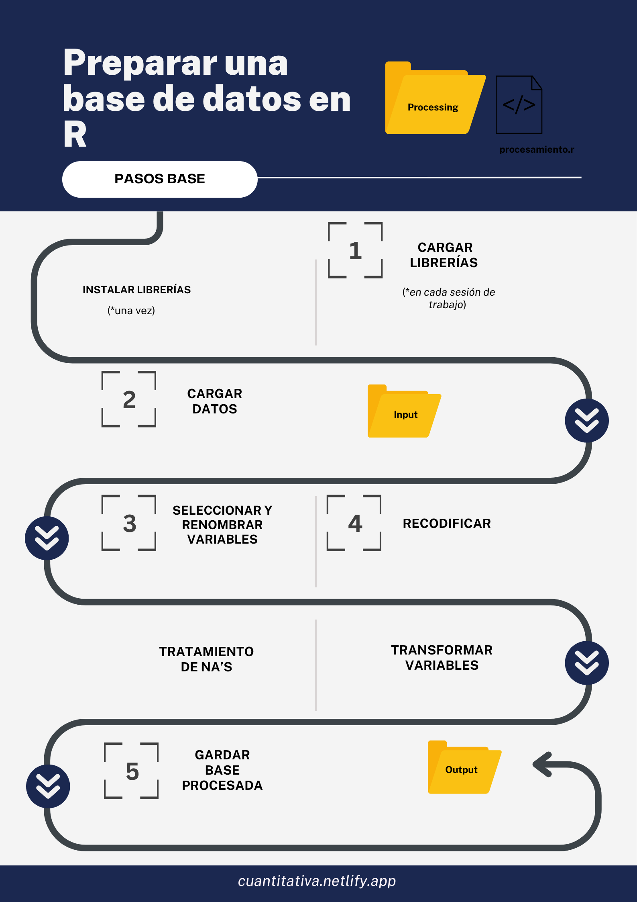
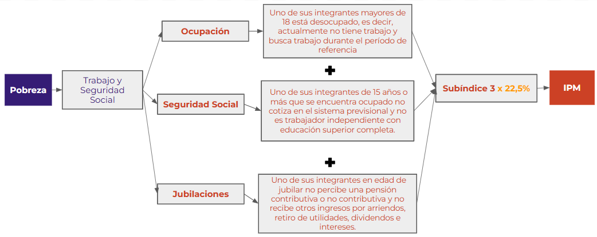

## Presentación

### Objetivo de la práctica

El objetivo de esta guía práctica es recordar algunos procedimientos básicos de la preparación de datos con R, y enfatizar en la recodificación de variables para la trasnformación de índices.

En detalle, aprenderemos:

1. Procesar una base de datos: CASEN 2022

2. Recodifcar y trasnformar indicadores según condiciones

3. Generar el índice de pobreza multidimensionl (IPM)


## 1. Repaso: recodificación y procesamiento 


### Niveles de medición: NOIR

::: callout-important
Para recodificar debemos **siempre** remitir a los niveles de medición de las variables. 
:::

Cuando recodifcamos buscamos *reducir o agrupar categorías*. Aquello es posible considerando los **niveles de medición de las variables (NOIR)** y sus **propiedades** (que son *acumulativas*). De modo que recodificamos variables que sean cuantitativas a cualitativas, no al revés.

- **N**: variables **n**ominales. Propiedad (1): *clasifican*
- **O**: variables **o**rdinales. Propiedad (2): *clasifican y ordenan*
- **I**: variables **i**ntervalares. Propiedad (3): *clasifican, ordenan y expresan magnitudes*
- **R**: variables de **r**azón. Propiedad (4): *clasifican, ordenan, expresan magnitudes y permiten operar sus categorías (aditividad)*


### Pasos procesamiento

 


## 2. CASEN: Dimensión Trabajo y Seguridad Social en IPM

 


```{r}

# Cargamos las librerías
pacman::p_load(tidyverse, #colección de paquetes, de la cual utilizaremos dplyr y haven
               haven, # cargar y exportar bases de datos en formatos .sav 
               dplyr) # para manipular datos

# Importamos los datos
casen <- read_sav("../assignment/input/casen.sav")

```

### Ocupación

Definición operacional:

> El hogar es carente si uno de sus integrantes mayores de 18 está desocupado, es decir, actualmente no tiene trabajo y busca trabajo durante el período de referencia

Considerando dicha definición, se trata de un indicador compuesto, por lo que debemos considerar las siguientes variables para su construcción: 

- edad (mayor a 18)
- o5 (busca trabajo)


```{r}

proc_casen <- casen %>% mutate(ocupacion = case_when
                               (edad > 18 ~ 1,
                                  edad < 18 ~ 0,
                                 o5 %in% c(1,2) ~ 1,
                                 o5 == 3 ~ 0 )) %>%
  group_by(id_vivienda) %>%
  mutate(n_ocupacion = sum(ocupacion, na.rm = TRUE)) %>%
  ungroup()


proc_casen <- proc_casen %>%
  mutate(
    carencia_ocupacion = if_else(n_ocupacion > 1, "Carente", "No carente")
  )


```


### Seguridad Social

Definición operacional:

> El hogar es carente si uno de sus integrantes de 15 años o más que se encuentra ocupado no cotiza en el sistema previsional y no es trabajador independiente con educación superior completa.

Considerando dicha definición, se trata de un indicador compuesto, por lo que debemos considerar las siguientes variables para su construcción: 

- edad (mayor o igual a 15)
- o1 (ocupado)
- o15 (no es trabajador independiente)
- o31 (no cotiza en el sistema previsional)

```{r}

proc_casen <- proc_casen %>% mutate(seguridad_social = case_when
                               (edad >= 15 ~ 1,
                                 edad < 15 ~ 0,
                                 o15 %in% c(3,4,5,6,7,8,9) ~ 1,
                                 o15 %in% c(1,2) ~ 0,
                                 o1 == 2  ~ 1, 
                                 o1 == 1 ~ 0,
                                 o31 == 2 ~ 1,
                                 o31 == 1 ~ 0,
                                 o31 == -88 ~ NA)) %>%
  group_by(id_vivienda) %>%
  mutate(n_seguridad_social = sum(seguridad_social, na.rm = TRUE)) %>%
  ungroup()

proc_casen <- proc_casen %>%
  mutate(
    carencia_seguridad_social = if_else(n_seguridad_social > 1, "Carente", "No carente")
  )
```


### Jubilaciones 

Definición operacional:

> El hogar es carente si uno de sus integrantes en edad de jubilar no percibe una pensión contributiva o no contributiva y no recibe otros ingresos por arriendos, retiro de utilidades, dividendos e intereses.

Considerando dicha definición, se trata de un indicador compuesto, por lo que debemos considerar las siguientes variables para su construcción: 

- edad (mayor o igual a 60 años)
- o31 (no percibe una pensión contributiva o no contributiva)
- y12a_preg, y15a_preg, y15b_preg, y15c_preg (no recibe otros ingresos)


```{r}
proc_casen <- proc_casen %>% mutate(jubilaciones = case_when
                               (edad >= 60 ~ 1,
                                 edad < 60 ~ 0,
                                 y12a_preg == 2 ~ 1,
                                 y12a_preg == 1 ~ 1, 
                                 y12a_preg %in% c(-88, -99) ~ NA,
                                 y15a_preg == 2 ~ 1,
                                 y15a_preg == 1 ~ 1, 
                                 y15a_preg %in% c(-88, -99) ~ NA,
                                 y15b_preg == 2 ~ 1,
                                 y15b_preg == 1 ~ 1, 
                                 y15b_preg %in% c(-88, -99) ~ NA,
                                 y15c_preg == 2 ~ 1,
                                 y15c_preg == 1 ~ 1, 
                                 y15c_preg %in% c(-88, -99) ~ NA,
                                 o1 == 2  ~ 1, 
                                 o1 == 1 ~ 0,
                                 o31 == 2 ~ 1,
                                 o31 == 1 ~ 0,
                                 o31 == -88 ~ NA)) %>%
  
# para visualizar 
  group_by(id_vivienda) %>%
  mutate(n_jubilaciones = sum(jubilaciones, na.rm = TRUE)) %>%
  ungroup()

# 
proc_casen <- proc_casen %>%
  mutate(
    carencia_jubilaciones = if_else(n_jubilaciones > 1, "Carente", "No carente")
  )

```

### Calculamos la dimensión 
```{r}

proc_casen <- proc_casen %>%  mutate(trabajo = rowMeans(across(c(ocupacion, seguridad_social, jubilaciones)), na.rm = TRUE))

summary(proc_casen$trabajo)
```

## 3. Índice de Pobreza Multidimensional (IPM)

En la base de datos `CASEN` pueden encontrar las variables agregadas del módulo PM que cotneien las variables recodificadas para calcular el índice de Pobreza Multidimensional (IPM), todas con el sufijo `hh_d_` . 

Con dichas variables, calcularemos el índice completo. 

### Seleccionar
Como la base de datos sigue siendo la misma, solo seleccionaremos las variables en un nuevo objeto de nombre `ipm`:
```{r}

# Usando los datos del objeto casen, crearemos el objeto ipm, al cual le asociaremos el siguiente procedimiento:
ipm <- casen %>% select(
  
  # Educación
  hh_d_asis,                       
  hh_d_rez, 
  hh_d_esc, 
  
  # Salud        
  hh_d_mal,
  hh_d_acc,
  hh_d_prevs,
  
  # Trabajo y Seguridad Social
  hh_d_act,
  hh_d_cot,
  hh_d_jub, 
 
   # Vivienda y Entorno
  hh_d_habitab,
  hh_d_servbas,
  hh_d_entorno,
 
   # Redes y Cohesión Social
  hh_d_appart,
  hh_d_tsocial,
  hh_d_seg,
  area,
  region)
```


### Dimensiones
Ahora, calculamos las dimensiones
```{r}

# Usando los datos del objeto ipm, sobreescribimos el siguiente procedimiento:
ipm <- ipm %>%
  
  # mutaremos/crearemos 5 nuevas variables correspondientes a las dimensiones
  mutate(
    
  # la variable educacion corresponderá al promedio por fila de las 3 varianles seleccionadas:  
    educacion = rowMeans(across(c(hh_d_asis, hh_d_rez, hh_d_esc)), na.rm = TRUE),
    
  # la variable salud corresponderá al promedio por fila de las 3 varianles seleccionadas:  
    salud     = rowMeans(across(c(hh_d_mal,hh_d_acc, hh_d_prevs)), na.rm = TRUE),
    
  # la variable trabajo corresponderá al promedio por fila de las 3 varianles seleccionadas:  
    trabajo   = rowMeans(across(c(hh_d_act, hh_d_cot, hh_d_jub)), na.rm = TRUE),
  
  # la variable vivienda corresponderá al promedio por fila de las 3 varianles seleccionadas: 
    vivienda  = rowMeans(across(c(hh_d_habitab,hh_d_servbas,hh_d_entorno)), na.rm = TRUE), 
  
  # la variable redes_cohesion corresponderá al promedio por fila de las 3 varianles seleccionadas: 
    redes_cohesion = rowMeans(across(c(hh_d_appart, hh_d_tsocial, hh_d_seg)), na.rm = TRUE))


```

### Índice
Ahora, calculamos el índice con su ponderación:
```{r}

# Usando los datos del objeto ipm, sobreescribimos el siguiente procedimiento:
ipm <- ipm %>% mutate(
  
  # creamos la nueva variable: 
  ipm = (educacion*0.225 +  # multplicamos por su peso
           salud*0.225 +    # multplicamos por su peso
           trabajo*0.225 +  # multiplicamos por su peso
           vivienda*0.225 + # multiplicamos por su peso
           redes_cohesion*0.10)/1) # multiplicamos por su peso


```

```{r}
#| warning: false
#| message: false
library(ggplot2)

ggplot(data.frame(ipm), aes(x = ipm)) +
  geom_histogram(color = "#1E2D59", fill = "#1E2D59") +
  ggtitle("Distribución IPM")
```


### Interpretación
Por último, establcemos el umbral, para poder interpretar:
```{r}

# Usando los datos del objeto ipm, sobreescribimos el siguiente procedimiento:
ipm <- ipm %>% mutate(ipm_recod =  if_else(
  ipm >= 0.25, # si el valor del índice es menor o igual a 0.25 
  1, # dicha fila tome el valor 1
  0, # la fila que no corresponda a la condición tome valor 0
  missing = NA_real_) # si no cumple ninguna, que sea un NA 
  )

```

```{r}
#| warning: false
#| message: false
library(ggplot2)

graf <- ipm %>%
  mutate(
    ipm_recod = factor(ipm_recod, labels = c("No presenta pobreza", "Presenta pobreza")),
    area = factor(area, labels = c("Urbano", "Rural"))
  )

ggplot(data = graf, 
       mapping = aes(x = ipm_recod, fill = area)) + # especificamos datos y mapping 
  geom_bar(position = "dodge2") + # agregamos geometria y especificamos posicion 
  labs(title ="IPM, segun área 2022", 
       x = "IPM", 
       y = "Frecuencia",
       caption = "Fuente: Elaboración propia en base a Encuesta CASEN 2022.") +# agregamos titulo, nombres a los ejes y fuente
  geom_text(aes(label = ..count..), stat = "count", colour = "black", 
    vjust = 1.5, position = position_dodge(.9), size = 3) # agregamos freq de cada barra por grupo


```


## 4. Ejercicios 

### Ejercicio individual

Crear una nueva variable "indep_con_vivienda" usando `case_when()` y con las siguientes condiciones:

- con la variable o15: *trabajadores independientes*
- con la variable v13_propia: **propia pagada o pagándose**


### Ejercicio grupal

Reunanse en grupos. Considerando la **dimensión de educación** del IPM, *elija uno de los tres indicadores y transforme una nueva variable* correspondiente al indicador. Para ello, deberán descargar desde la página del Observatorio Social, la base de datos de la CASEN 2022 e importar dicha base para seleccionar las variables a utilizar.  

- **Asistencia escolar**: Uno de sus integrantes de 4 a 18 años de edad no está asistiendo a un establecimiento educacional y no ha egresado de cuarto medio, o al menos un integrante de 6 a 26 años tiene una condición permanente y/o de larga duración y no asiste a un establecimiento educacional.

- **Escolaridad**: Uno de sus integrantes mayores de 18 años ha alcanzado menos años de escolaridad que los establecidos por ley, de acuerdo a su edad.

- **Rezago escolar**: Uno de sus integrantes de 21 años o menos asiste a educación básica o media y se encuentra retrasado dos años o más.


