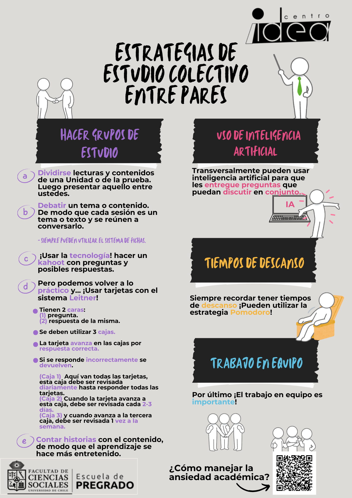

## <i class="fas fa-tasks"></i> Estudio

:::: {style="background-color: #F2DFCD "}
### Preguntas previas

- ¿Cuáles son tus **hábitos de estudio actuales**? 
- ¿Cómo te organizas para estudiar?
- ¿Cuál es tu rutina? ¿Cómo organizas tu día?
- ¿Qué sientes importante a la hora de pensar el estudio?¿Lo planificas?
::::

Todas estas ideas son importantes al momento de sentarnos a estudiar o de pensar en cómo estudiar. A continuación se presentan **5 ideas claves para estudiar en la Universidad**. 

### 1. Organización del tiempo (Planificación)

Lo primordial es percatarnos que para estudiar es necesario dedicar tiempo. Ya sea asistiendo a las clases o con estrategías de estudio autonómo. El tiempo es lo más importante, pero lo realmente relevante es la forma en qué lo organizamos. Aquí es cuando hablamos de planificación del estudio. 

La planificación implica que debemos organizar en base a diversos criterios el tiempo que se dedicará en la escala temporal que definamos según nuestra comodidad. Para ello, lo básico a tener en consideración son los siguienes 5 pasos: 

1. <strong>Operacionalizar las tareas</strong>

Esta idea cobra mucho sentido cuando ya pasamos por este curso, ya que manejamos la idea de operacionalización. En este contexto se entiende como la idea de identificar las tareas que componen otras. Así, tendremos la tarea general de "Estudiar para una prueba", pero debemos enfocarnos en tareas más pequeñas que nos permitan lograr aquella (como puede ser leer un capítulo de literatura, ejercitar cálculo, etc.).

2.  <strong>Priorizar/Jerarquización de tareas: </strong>
    - Según **urgencia** e **importancia**
    - Según **tiempo** / **deadline**
    - Según **dificultad** / **carga cognitiva** y **académica**
    
3. <strong> Establecer metas y límites de esas tareas: </strong>
    - IMPORTANTE: que sean **logrables** para ti
    - Estas metas deben ser de acuerdo al **tiempo** y a la **magnitud del objetivo** de la tarea.  

4.  <strong>Seleccionar el orden de la planificación  </strong>
    - Si será **semanal** / **mensual** / **diario**
    - IMPORTANTE: Recuerda contemplar el **estudio** y el **descanso**
    - ¿Dónde hacerlo? 
      a. **Calendarios físicos**  
        <i class="fas fa-download"></i> [Descarga de planilla mensual](./files/mensual.pdf)  
    <i class="fas fa-download"></i> [Descarga de planilla semanal](./files/semanal.pdf)  
    <i class="fas fa-download"></i> [Descarga de planilla diaria](./files/diario.pdf)
      
      b. **Aplicaciones**  
    <i class="fas fa-link"></i> [Apps para Android](https://www.xatakandroid.com/listas/mejores-aplicaciones-calendario-para-android-comparativa-a-fondo?)  
     <i class="fas fa-link"></i> [Apps para Windows](https://www.onecal.io/es/blog/calendar-apps-for-windows?)  
      <i class="fas fa-link"></i> [Apps para Linux](https://www.onecal.io/es/blog/calendar-apps-for-linux)  
      <i class="fas fa-link"></i> [Más](https://blog.hubspot.es/sales/apps-calendario?)

5. **Después:** <strong>Evalúa la experiencia</strong> 

Este último paso es el más relevante, ya que la planificación puede cambiar en función de tus necesidades y comodidades. 

### 2. Técnicas de estudio 

:::: .columns

::: {.column width="30%"}
:::: {style="border: 2px solid #BF382C; border-radius: 8px; padding: 10px;"}
#### a. Pomodoro

:::: {style="background-color: #F2DFCD "}
<i class="fas fa-clock"></i> Dividir el tiempo de estudio en plazos de 25 minutos, los que llamaremos "Pomodoros"
 
<i class="fas fa-bed"></i> Intervalo de descanso de 5 minutos
::::

- **4 pomodoros** y **3 descansos**. 
- En el 4to intervalo de descanso se aconseja desconectarse de la actividad y descansar entre **15-30 minutos**.
::::
:::

::: {.column width="2%"}
:::

::: {.column width="55%"}
:::: {style="border: 2px solid #BF382C; border-radius: 8px; padding: 10px;"}
#### b. Sistema Leitner

Tenemos **tarjetas** <i class="fas fa-file"></i>

Estas tienen **2 caras**: 
  (1) **Pregunta**.  
  (2) **Respuesta** de la misma.

Se deben utilizar **3 cajas** <i class="fas fa-cubes"></i>

- La tarjeta **avanza** en las cajas por respuesta **correcta**.
- Si se responde **incorrectamente se devuelven**.

<i class="fas fa-cube"></i> (**Caja 1**)  Aquí van todas las tarjetas, esta caja debe ser **revisada diariamente** hasta responder todas las tarjetas.
 
<i class="fas fa-cube"></i>(**Caja 2**) Cuando la tarjeta avanza a esta caja, debe ser **revisada cada 2-3 días**.
 
<i class="fas fa-cube"></i> (**Caja 3**) y cuando avanza a la tercera caja, debe ser **revisada 1 vez a la semana**.
::::
:::
::::

:::: .columns

::: {.column width="30%"}
:::: {style="border: 2px solid #BF382C; border-radius: 8px; padding: 10px;"}
#### c. Método Robinson 

<i class="fas fa-book-reader"></i> Lectura en 5 pasos: (1) **explorar**, (2) **preguntar**, (3) **leer**, (4) **recitar** y (5) **repasar**:

:::: {style="background-color: #F2DFCD "}
1. Lectura rápida y **general**: Aspectos principales. 
2. Segunda lectura: Actitud **crítica**
3. Tercera lectura: [Subrayar]() y <mark style="background-color: lime; color: black;">destacar</mark>
4. Expresar en **voz alta** aspectos importantes comprendidos.
::::
::::
:::

::: {.column width="2%"}
:::

::: {.column width="30%"}
:::: {style="border: 2px solid #BF382C; border-radius: 8px; padding: 10px;"}
#### d. Método de Cornell

<i class="fas fa-file-alt"></i> Dividir en 4 partes una hoja, según elementos del texto:

| Título | Palabras claves |
|--------|-----------------|
| **Apuntes** | **Resumen**     |
::::
:::

::: {.column width="2%"}
:::

::: {.column width="30%"}
:::: {style="border: 2px solid #BF382C; border-radius: 8px; padding: 10px;"}
#### e. Técnicas tradicionales

- Hacer **resúmenes**.
- Escribir **Listas**.
- Hacer **cuadros comparativos** con la información.
- **Explicar el tema**, puede ser a ti u otra persona. Aquello puede convertirse en una conversación interesante!
- Leer en **voz alta**
- Tener un **calendario de estudio**
- Realizar **esquemas** o **mapas mentales** con la informacion.
::::
:::
::::

### 3. ¿Cómo optimizo mi estudio en la U?

Pregunta previa: ***¿cómo organizo las horas que paso en la Univeridad?***

La clave aquí es: [**Caracterizar** mi estudio, en base a generar un espacio que me entregue **Comodidad** y **Concentración**.]()

:::: {style="background-color: #F2DFCD "}
**Preguntas orientadoras** 

- ¿Aprendo más de forma **auditiva**, **visual**, **lector** o **escritor**?
- ¿Me sirven **horarios estructurados** o **bloques más libres**?
- En base a mi experiencia pasada, ¿qué límites logro *cumplir sí o sí*?
- ¿Me acomodan **tareas pequeñas** distribuidas *durante la semana* o **tareas más completas** por día por ej.?
- ¿En qué **lugares** me he *concentrado* más de la U? ¿Por qué? ¿Qué **elementos** optimizaron mi estudio?
- ¿Me acomoda **escuchar algo** mientras estudio o necesito **silencio absoluto**?
- ¿Me *distrae* mi **celular** u otro dispositivo? ¿Puedo mantenerlo apagado? ¿Qué estrategias puedo utilizar para reducir su uso?
::::

:::: .columns

::: {.column width="65%"}
### Estudio entre pares
{ width=90% }
:::

::: {.column width="30%"}
### Manejo de la ansiedad académica

<i class="fas fa-link"></i> [¿Qué es y cómo manejar la ansiedad académica?](https://concienciasaludable.uchile.cl/2023/10/22/que-es-y-como-manejar-la-ansiedad-academica/)
:::
::::

##  <i class="fas fa-book-reader"></i> Lectura

Estos tips pueden encontrarlos en [Aprendizaje UChile](https://aprendizaje.uchile.cl/recursos-para-leer-escribir-y-hablar-en-la-universidad/leer/prepara-la-lectura/)

### La lectura se da en tres tiempos:

#### 1. Pre-lectura

<strong>Paso 1: Identifica el propósito de la lectura, según este hay distinos tipos de lectura:</strong>

- Lectura profunda
- Lectura focalizada o estratégica
- Lectura exploratoria
- Lectura de elaboración 

<strong>Paso 2: Identifica el tiempo que necesitas para la lectura</strong>

<strong>Paso 3: Crea una panorámica del texto</strong>

#### 2. Durante la lectura: Lectura activa

<strong>Paso 1: Realiza resúmenes intermedios</strong>

<strong>Paso 2: Realiza preguntas en cada apartado o sección</strong>

#### 3. Post-lectura

<strong>Resume la lectura</strong>

Para ello puedes utilizar diversas técnicas. La que más destaca son las fichas de lectura, acá te dejamos un orientación para hacer una: [¿Cómo hacer una ficha de lectura?](https://aprendizaje.uchile.cl/recursos-para-leer-escribir-y-hablar-en-la-universidad/profundiza/lectura/ficha-lectura/)

### Estrategias de lectura

:::: {style="border: 2px solid #BF382C; border-radius: 8px; padding: 10px;"}
#### Lectura en capas

- Primera lectura: Idea general 

- Segunda lectura: Subrayar
palabras clave 

- Tercera lectura: Reformular en
palabras simples 

La primera vez, lees sin presión. La segunda, detectas lo importante. La tercera, lo explicas con tus palabras
::::

:::: {style="border: 2px solid #BF382C; border-radius: 8px; padding: 10px;"}
#### Técnica Feynman

- Paso 1: Leer con atención 

- Paso 2: Explicar con palabras
comunes y sencillas ️

- Paso 3: Detectar lagunas en tu
comprensión 
::::

:::: {style="border: 2px solid #BF382C; border-radius: 8px; padding: 10px;"}
#### SQ3R

- [S]() Survey: Explora títulos,
subtítulos, negritas

- [Q]() Question: Formula preguntas
clave antes de leer

- [R]() Read: Lee buscando
respuestas

- [R]() Recite: Resume con tus
palabras

- [R]() Review: Revisa lo esencial
::::

:::: {style="border: 2px solid #BF382C; border-radius: 8px; padding: 10px;"}
#### Mapas y esquemas
::::

### Recursos para la lectura

- <strong>Físicos</strong>: Destacadores, post-it, lápices de colores, hojas, etc.

- <strong>Digitales</strong>: Diccionarios, generadores de citas /gestores bibliográficos como [Mendeley](https://www.mendeley.com/) o [Zotero](https://www.zotero.org/). 

- <strong>Mapas conceptuales o mentales</strong>

- <strong>Ficha de lectura</strong>

## <i class="fas fa-user-edit"></i> Escritura

### Paso previo antes de empezar a escribir: ¡Conozcamónos!

<i class="fas fa-highlighter"></i> [¿Cuál es tu perfil escrit-r?](https://uquiz.com/quiz/yJm8Wz/%C2%BFcu%C3%A1l-es-tu-perfil-de-escritora-o-escritor?p=188595)

