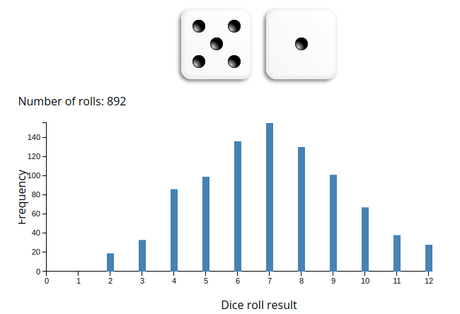

class: front


```{r setup, include=FALSE, cache = FALSE}
require("knitr")
options(htmltools.dir.version = FALSE)
pacman::p_load(RefManageR)
# bib <- ReadBib("../../bib/electivomultinivel.bib", check = FALSE)
opts_chunk$set(warning=FALSE,
             message=FALSE,
             echo=TRUE,
             cache = FALSE, fig.width=10, fig.height=8)
pacman::p_load(flipbookr, tidyverse)
```


```{r xaringanExtra, include=FALSE}
xaringanExtra::use_xaringan_extra(c("tile_view", "animate_css"))
xaringanExtra::use_scribble()
```

.pull-left-wide[
# Estadística Correlacional]

.pull-right-narrow[]

## Inferencia, asociación y reporte

----
.pull-left[

## Juan Carlos Castillo
## Sociología FACSO - UChile
## 2do Sem 2024
## [.orange[correlacional.netlify.com]](https://encuestas-sociales.netlify.com)
]


.pull-right-narrow[
.center[
.content-block-gray[
## .curso[Inferencia 1:] 
## .black[Datos, probabilidad y distribuciones muestrales]]
]
]
---

layout: true
class: animated, fadeIn

---
class: inverse

## **.black[Objetivos de la sesión de hoy]**
<br>

### 1. Recordar y nivelar aprendizajes previos a este curso, fundamentalmente respecto al manejo de datos, medición y varianza

### 2. Introducción a probablidad e inferencia


---
class: inverse right

.pull-left-narrow[

]

.pull-right-wide[
# .black[Contenidos]

<br>
<br>

## Bases

## Probabilidad e inferencia
]

---
class: inverse right

.pull-left-narrow[

]

.pull-right-wide[
# .black[Contenidos]

<br>
<br>

## .yellow[Bases]

## Probabilidad e inferencia
]


---
# Datos

* Los datos son una expresión numérica de la medición de al menos una .roja[*característica*] de a lo menos una .roja[*unidad*]  en a lo menos .roja[*un punto en el tiempo*]

--
 + Ejemplo: La esperanza de vida en Chile el 2017 fue de 79,9 años

   - Característica (variable) : esperanza de vida

   - Unidad: Años

   - Punto en el tiempo: 2017

---
# Medir

.pull-left[
-   “asignar números, símbolos o valores a las propiedades de objetos o eventos de acuerdo con reglas” (Stevens, 1951)

- Vincula conceptos abstractos con indicadores empíricos
]

.pull-right[

]
---
# Medir: requisitos básicos

<br>

- **Exhaustividad**: el mayor número de categorías significativas.
  - Ej: ¿Qué categorías se deben considerar para población migrante?

- **Exclusividad**: atributos mutuamente excluyentes


---
## Ejemplos de estudios / bases de datos

1. [Encuesta Centro de Estudios Públicos](https://www.cepchile.cl/cep/site/edic/base/port/encuestacep.html)

2. [Encuesta CASEN](http://observatorio.ministeriodesarrollosocial.gob.cl/casen-multidimensional/casen/casen_2017.php)

3. [Encuesta Lapop](https://www.vanderbilt.edu/lapop-espanol/)

4. [ELSOC](https://coes.cl/encuesta-panel/)

---
# Variables

- Una variable representa cualquier cosa o propiedad que varia y a la cuál se le asigna un valor. Es decir:

- $Variable \neq Constante$

- Pueden ser visibles o no visibles/latentes. (Ej: peso / inteligencia)

---
## Variables

- discretas (Rango finito de valores):

      - Dicotómicas
      - Politómicas

- continuas:

      - Rango (teóricamente) infinito de valores.

---
# Tendencia Central

Descripción básica de una variable: 

* **Moda**: valor que ocurre más frecuentemente

* **Mediana**: valor medio de la distribución ordenada. Si N es par, entonces es el promedio de los valores medios

* **Media** o promedio aritmético: suma de los valores dividido por el total de casos

---
class: inverse middle center

Pregunta de tendencia central:

# ¿Puede la mayoría ganar menos ingresos que el promedio?

---
.pull-left-narrow[
# Dispersión:
## Varianza
]

.pull-right-wide[


]

---
.pull-left-narrow[
# Dispersión:
## Varianza
]

.pull-right-wide[


]


---
.pull-left-narrow[
# Dispersión:
## Varianza
]

.pull-right-wide[


]

---
# Dispersión:


---
class: inverse, middle, center

#La VARIANZA equivale al promedio de la suma de las diferencias del promedio al cuadrado

---
class: middle


.pull-left[
#  Desviación Estándar
<br>

]

.pull-right[
  - Raiz Cuadrada de la varianza.


  - Expresada  en la mismas unidades que los puntajes de la escala original
]

---
class: inverse right

.pull-left-narrow[

]

.pull-right-wide[
# .black[Contenidos]

<br>
<br>

## Bases

## .yellow[Probabilidad e inferencia]
]


---
# Inferencia: la otra parte del análisis

Cuando se analizan datos, 2 cosas principales

.pull-left[
.content-box-yellow[
- cálculo del estadístico:

  - promedio

  - desviación estándar

  - correlación
  
  - ...
]
]

.pull-right[
.content-box-red[
- inferencia: ¿existe este estadístico en la población?

  - probabilidad
  
  - error
  
  - significación
  
]
]
---


---

.pull-left-narrow[
# Inferencia
]


.pull-right-wide[
¿En qué medida se pueden relacionar resultados que se encuentran en un .green[(sub)conjunto de unidades] con lo que ocurre .red[en general]?]

--

.pull-right-wide[
Ej: si en un subconjunto de la población encuentro que el promedio de matemáticas es mayor en mujeres que en hombres ¿es esto un .orange[reflejo] de lo que ocurre en general, o se debe solo al .red[azar]? ¿se puede .green[extrapolar] a la poblacion?
]

???

mapa y territorio, Borges
lidiando con el caos y la incertidumbre
la domesticación de la casualidad
error

---
background-image: url("https://images.rawpixel.com/image_800/cHJpdmF0ZS9sci9pbWFnZXMvd2Vic2l0ZS8yMDIyLTEyL3JtNjE0LWotYmctMDA4LmpwZw.jpg")
background-size: cover


.medium[En aquel Imperio, el Arte de la Cartografía logró tal Perfección que el mapa de una sola Provincia ocupaba toda una Ciudad, y el mapa del Imperio, toda una Provincia. Con el tiempo, estos Mapas Desmesurados no satisficieron y los Colegios de Cartógrafos levantaron un Mapa del Imperio, que tenía el tamaño del Imperio y coincidía puntualmente con él.

Menos Adictas al Estudio de la Cartografía, las Generaciones Siguientes entendieron que ese dilatado Mapa era Inútil y no sin Impiedad lo entregaron a las Inclemencias del Sol y los Inviernos. En los desiertos del Oeste perduran despedazadas Ruinas del Mapa, habitadas por Animales y por Mendigos; en todo el País no hay otra reliquia de las Disciplinas Geográficas.]

.small[Suárez Miranda, Viajes de Varones Prudentes, Libro Cuarto, Cap. XLV, Lérida, 1658.]

--

.right[Borges -  Del Rigor de la Ciencia]


---
.pull-left-narrow[


]
.pull-right-wide[

## Conceptos claves de inferencia
- La **inferencia** en estadística se refiere a la relación que existe entre los resultados obtenidos basados en nuestra muestra y la población

{{content}}

]

--

- **¿En qué medida podemos hacer inferencias desde nuestra muestra a la población?**

{{content}}

--

- Un concepto central es la probabilidad de **ERROR**


---
# Parámetros y estadísticos

----

|                     	| Población (parámetro)  	| Muestra (estadístico)  	|
|---------------------	|------------	|---------	|
| Promedio            	|  $\mu$           	|   $\bar{x}$           	|
| Varianza            	|        $\sigma²$      	|  $s²$                  	|
| Desviación estándar 	|        $\sigma$        	| $s$                    	|
| Correlación 	|        $\rho$        	| $r$                    	|


---
# Muestreo y variabilidad

¿Cómo es posible que la media x̄ obtenida a partir de una muestra de unos pocos hogares de todos los del país, pueda ser una estimación precisa de µ?

Una segunda muestra aleatoria obtenida en el mismo momento estaría
formada por hogares distintos y, sin duda, daría un valor distinto de x̄

---
# Muestreo y variabilidad

**Variabilidad muestral**: el valor de un estadístico varía en un muestreo aleatorio repetido

¿Cuánto varía? 

¿En qué rangos?

¿Qué tan **probable** es el rango de variación?

¿Es un rango aceptable en términos de investigación social?

---
.center[

]

---
# Aleatoriedad y probabilidad
----

.pull-left[
.content-box-red[
Llamamos a un fenómeno **aleatorio** si los resultados individuales son inciertos y, sin embargo, existe una **distribución regular** de los resultados después de un gran número de repeticiones.]
]

--

.pull-right[
.content-box-green[
La probabilidad de cualquier resultado de un fenómeno aleatorio es la **proporción de veces**  que el resultado se da después de una larga serie de
repeticiones

]]

---


.pull-left-narrow[
# Azar y repetición
El comportamiento del azar es impredecible con pocas repeticiones pero presenta un comportamiento regular y predecible con muchas repeticiones.
]

.pull-right-wide[

]
---
class: middle

# (Dato freak)

.pull-left[
Cerca del año 1900, el estadístico inglés Karl Pearson lanzó al aire una moneda **24.000** veces. El resultado: 12.012 caras, una proporción de 0,5005.]

.pull-right[


]


---
# Dados

Tenemos 1 dado, cuál es la probabilidad de que salga 3 al lanzarlo?

- Espacio muestral S= conjunto de todos los resultados posibles

$$S=\{1,2,3,4,5,6\}$$

- N del espacio muestral= 6 sucesos posibles

- Probabilidad de que salga 3 al tirar el dado= 
$\frac{1}{6}=0.166$

---
class: inverse right

###Un **.yellow[modelo de probabilidad]** para un fenómeno aleatorio consiste en un espacio muestral .black[S] y una asignación de probabilidades .black[P].

--

### El **.yellow[espacio muestral .black[S] ]** es el conjunto de todos los resultados posibles de un fenómeno aleatorio. 

--

### Un **.yellow[suceso]** es un conjunto de resultados. .black[P] asigna un número .black[P(A)] a un suceso .black[A] como su probabilidad.

---
# Reglas modelo de probabilidad


---

# [Dados, probabilidades y distribuciones](https://academo.org/demos/dice-roll-statistics/)

----
.pull-left[

]

.pull-right[
Ejercicio:
  
  - probar lanzando 1 dado repetidas veces

  - probar con 2 dados
  
  - ... y con 6

-> [link](https://academo.org/demos/dice-roll-statistics/)
]

---
# Dados, probabilidades y áreas
.center[

]
---
# Dados, probabilidades y áreas
.center[

]
---
# Dados, probabilidades y áreas
.center[

]
---
# Dados, probabilidades y áreas

.pull-left[

]

.pull-right[
<br>
 Eventos posibles (espacio muestral S) = 6 = (1,2,3,4,5,6)


\begin{align*}
P(x)\geq4&=P(4)+P(5)+P(6) \\
&=0.1\overline{6}+0.1\overline{6}+0.1\overline{6} \\
&=0.5
\end{align*}
]

---
# Sucesos con distinta probabilidad

Ej: suma de 2 dados al azar repetidos
.center[

]

---
# Distribución muestral del promedio

- si extraemos repetidamente 2 dados, y obtenemos su **promedio**, el gráfico de frecuencias tenderá a una forma acampanada

- esto ocurre simplemente porque la probabilidad de valores extremos (como promedio 1 o promedio 6) es mucho menor que la de obtener valores centrales

- por lo tanto, podemos aproximarnos al promedio de la población mediante el **promedio de los promedios** de muchas muestras 

---
class: inverse middle center

ahora ... 

# ¿Cómo estimar el promedio de los promedios .yellow[con una sola muestra]?

# `r emo::ji("thinking")`

---
class: inverse

# .yellow[Próxima clase]

## -> Error estándar y distribución normal ... o cómo estimar el promedio de los promedios con una sola muestra

---
# Y tarea: 

.pre[
```{r eval=FALSE}
# Generar todas las combinaciones posibles de dos dados
dado1 <- rep(1:6, each = 6)
dado2 <- rep(1:6, times = 6)

# Calcular la suma y el promedio para cada combinación
suma <- dado1 + dado2
promedio <- suma / 2

# Crear un data frame con los resultados
resultados <- data.frame(dado1, dado2, suma, promedio)

# Mostrar el data frame
print(resultados)


# Cargar la librería para gráficos
library(ggplot2)

# Gráfico de frecuencias para la suma
ggplot(resultados, aes(x = suma)) +
  geom_bar() +
  labs(title = "Gráfico de Frecuencias de la Suma", x = "Suma", y = "Frecuencia")

# Gráfico de frecuencias para los promedios
ggplot(resultados, aes(x = promedio)) +
  geom_bar() +
  labs(title = "Gráfico de Frecuencias de los Promedios", x = "Promedio", y = "Frecuencia")


```
]


---
class: front

.pull-left-wide[
# Estadística Correlacional]

.pull-right-narrow[]

## Inferencia, asociación y reporte

----
.pull-left[

## Juan Carlos Castillo
## Sociología FACSO - UChile
## 2do Sem 2024
## [.orange[correlacional.netlify.com]](https://encuestas-sociales.netlify.com)
]
    


