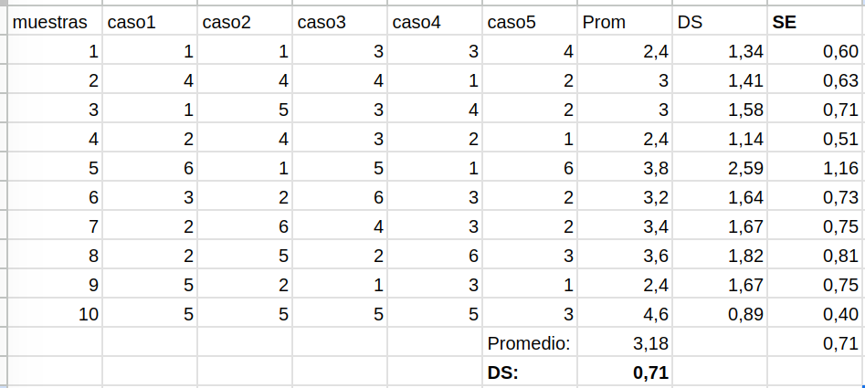

class: front


```{r setup, include=FALSE, cache = FALSE}
library(knitr)
opts_chunk$set(warning=FALSE,
             message=FALSE,
             echo=TRUE,
             comment = "",
             cache = TRUE, fig.width=10, fig.height=8)
pacman::p_load(flipbookr, tidyverse, kableExtra)
```


```{r xaringanExtra, include=FALSE}
xaringanExtra::use_xaringan_extra(c("tile_view", "animate_css"))
xaringanExtra::use_scribble()
```

.pull-left-wide[
# Estadística Correlacional]

.pull-right-narrow[]

## Asociación, inferencia y reporte


----
.pull-left[

## Juan Carlos Castillo
## Sociología FACSO - UChile
## 2do Sem 2024
## [.orange[correlacional.netlify.com]](https:/correlacional.netlify.com)
]


.pull-right-narrow[
.center[
.content-block-gray[
## .gray[Sesión 3:] 
## .curso[Inferencia 2:  Error estándar y curva normal]]
]
]

---

layout: true
class: animated, fadeIn

---
# La tarea:

.pre[
```{r eval=FALSE}
# Generar todas las combinaciones posibles de dos dados
dado1 <- rep(1:6, each = 6)
dado2 <- rep(1:6, times = 6)

# Calcular la suma y el promedio para cada combinación
suma <- dado1 + dado2
promedio <- suma / 2

# Crear un data frame con los resultados
resultados <- data.frame(dado1, dado2, suma, promedio)

# Mostrar el data frame
print(resultados)


# Cargar la librería para gráficos
library(ggplot2)

# Gráfico de frecuencias para la suma
ggplot(resultados, aes(x = suma)) +
  geom_bar() +
  labs(title = "Gráfico de Frecuencias de la Suma", x = "Suma", y = "Frecuencia")

# Gráfico de frecuencias para los promedios
ggplot(resultados, aes(x = promedio)) +
  geom_bar() +
  labs(title = "Gráfico de Frecuencias de los Promedios", x = "Promedio", y = "Frecuencia")

```
]

---

.medium[
.pull-left[
```{r eval=FALSE}
# Generar todas las combinaciones posibles de dos dados
dado1 <- rep(1:6, each = 6)
dado2 <- rep(1:6, times = 6)

# Calcular la suma y el promedio para cada combinación
suma <- dado1 + dado2
promedio <- suma / 2

# Crear un data frame con los resultados
resultados <- data.frame(dado1, dado2, suma, promedio)

# Mostrar el data frame
print(resultados)
```
]


.pull-right[
.pre[
```{r echo=FALSE}
# Generar todas las combinaciones posibles de dos dados
dado1 <- rep(1:6, each = 6)
dado2 <- rep(1:6, times = 6)

# Calcular la suma y el promedio para cada combinación
suma <- dado1 + dado2
promedio <- suma / 2

# Crear un data frame con los resultados
resultados <- data.frame(dado1, dado2, suma, promedio)

# Mostrar el data frame
print(resultados)
```
]
]
]
---

.medium[
.pull-left[
```{r eval=FALSE}

# Cargar la librería para gráficos
library(ggplot2)

# Gráfico de frecuencias para la suma
ggplot(resultados, aes(x = suma)) +
  geom_bar() +
  labs(title = "Gráfico de Frecuencias de la Suma", x = "Suma", y = "Frecuencia")

# Gráfico de frecuencias para los promedios
ggplot(resultados, aes(x = promedio)) +
  geom_bar() +
  labs(title = "Gráfico de Frecuencias de los Promedios", x = "Promedio", y = "Frecuencia")

```
]

.pull-right[
.pre[
```{r echo=FALSE}
# Cargar la librería para gráficos
library(ggplot2)

# Gráfico de frecuencias para la suma
ggplot(resultados, aes(x = suma)) +
  geom_bar() +
  labs(title = "Gráfico de Frecuencias de la Suma", x = "Suma", y = "Frecuencia")

# Gráfico de frecuencias para los promedios
ggplot(resultados, aes(x = promedio)) +
  geom_bar() +
  labs(title = "Gráfico de Frecuencias de los Promedios", x = "Promedio", y = "Frecuencia")

```
]
]
]

---
# Probabilidad de promedio de 2 dados al azar

```{r echo=FALSE}
# Generar todas las combinaciones posibles de dos dados
dado1 <- rep(1:6, each = 6)
dado2 <- rep(1:6, times = 6)

# Calcular la suma y el promedio para cada combinación
suma <- dado1 + dado2
promedio <- suma / 2

# Crear un data frame con los resultados
resultados <- data.frame(promedio)

# Calcular las frecuencias de cada promedio
tabla_frecuencias <- table(resultados$promedio)

# Calcular la probabilidad de ocurrencia de cada promedio
probabilidades <- tabla_frecuencias / sum(tabla_frecuencias)

# Crear la tabla final con valores de promedios y sus probabilidades
tabla_final <- data.frame(Promedio = as.numeric(names(probabilidades)), 
                          Probabilidad = as.numeric(probabilidades))

# Mostrar la tabla final
print(tabla_final)

```


---
# ¿Qué aprendimos de esto?

- la ocurrencia de algunos eventos (como la suma o promedio de dos dados) tienen una probabilidad determinada, lo que genera una **distribución teórica de probabilidad**

--

- si repito un evento aleatorio (ej: sacar muestras repetidas de dos dados y promediarlos) obtengo la **distribución empírica de probabilidad** (de frecuencias de los eventos)

--


- de acuerdo a la **ley de los grandes números**, el promedio empírico convergerá al teórico a medida que aumenta el número de repeticiones


---

```{r echo=FALSE}
# Generación de gráficos de prob teóricas y empíricas
# Definimos los promedios posibles (1.5, 2, 2.5, ..., 5.5, 6)
promedios_posibles <- seq(1, 6, by = 0.5)

# Calculamos la distribución de probabilidad teórica para cada promedio
# Las probabilidades corresponden a los valores de promedios específicos
probabilidades_teoricas <- c(1/36, 2/36, 3/36, 4/36, 5/36, 6/36, 5/36, 4/36, 3/36, 2/36, 1/36)

# Graficamos la distribución de probabilidad teórica
barplot(probabilidades_teoricas, 
        names.arg = promedios_posibles,
        main = "Distribución de Probabilidad Teórica del Promedio de Dos Dados",
        xlab = "Promedio de los Dados",
        ylab = "Probabilidad Teórica",
        ylim = c(0, 0.2),
        col = "orange")

teoric = recordPlot()
teoric

# Repeticiones

# Establecemos la semilla para reproducibilidad
set.seed(123)

# Simulamos 100 repeticiones de dos dados
dados1 <- sample(1:6, 100, replace = TRUE)
dados2 <- sample(1:6, 100, replace = TRUE)

# Calculamos el promedio de los resultados de ambos dados
promedio_dados <- (dados1 + dados2) / 2

# Calculamos las frecuencias de cada promedio posible
frecuencias_empiricas <- table(promedio_dados)

# Convertimos las frecuencias a probabilidades
probabilidades_empiricas <- frecuencias_empiricas / sum(frecuencias_empiricas)

# Graficamos las frecuencias de probabilidad empíricas
barplot(probabilidades_empiricas, 
        main = "Frecuencia de Probabilidad del Promedio de Dos Dados (100 repeticiones)",
        xlab = "Promedio de los Dados",
        ylab = "Frecuencia de Probabilidad",
        col = rgb(0.1, 0.5, 0.8, 0.6), # Azul con transparencia
        ylim = c(0, 0.2))

rep100_puro = recordPlot()

# Superponemos las barras de la distribución teórica
barplot(probabilidades_teoricas, 
        names.arg = promedios_posibles,
        col = rgb(0.8, 0.2, 0.2, 0.5), # Rojo con transparencia
        add = TRUE)

# Se agrega al gráfico existente
legend("topright", legend = c("Empírica", "Teórica"), 
               fill = c(rgb(0.1, 0.5, 0.8, 0.6), rgb(0.8, 0.2, 0.2, 0.5)),
               border = "white")

rep100 =recordPlot()        


# Rep 500
# Establecemos la semilla para reproducibilidad
set.seed(123)

# Simulamos 100 repeticiones de dos dados
dados1 <- sample(1:6, 500, replace = TRUE)
dados2 <- sample(1:6, 500, replace = TRUE)

# Calculamos el promedio de los resultados de ambos dados
promedio_dados <- (dados1 + dados2) / 2

# Calculamos las frecuencias de cada promedio posible
frecuencias_empiricas <- table(promedio_dados)

# Convertimos las frecuencias a probabilidades
probabilidades_empiricas <- frecuencias_empiricas / sum(frecuencias_empiricas)

# Graficamos las frecuencias de probabilidad empíricas
barplot(probabilidades_empiricas, 
        main = "Frecuencia de Probabilidad del Promedio de Dos Dados (500 repeticiones)",
        xlab = "Promedio de los Dados",
        ylab = "Frecuencia de Probabilidad",
        col = rgb(0.1, 0.5, 0.8, 0.6), # Azul con transparencia
        ylim = c(0, 0.2))

# Superponemos las barras de la distribución teórica
barplot(probabilidades_teoricas, 
        names.arg = promedios_posibles,
        col = rgb(0.8, 0.2, 0.2, 0.5), # Rojo con transparencia
        add = TRUE)

# Se agrega al gráfico existente
legend("topright", legend = c("Empírica", "Teórica"), 
       fill = c(rgb(0.1, 0.5, 0.8, 0.6), rgb(0.8, 0.2, 0.2, 0.5)),
       border = "white")

rep500 =recordPlot()        

# rep1500

# Establecemos la semilla para reproducibilidad
set.seed(123)

# Simulamos 100 repeticiones de dos dados
dados1 <- sample(1:6, 1500, replace = TRUE)
dados2 <- sample(1:6, 1500, replace = TRUE)

# Calculamos el promedio de los resultados de ambos dados
promedio_dados <- (dados1 + dados2) / 2

# Calculamos las frecuencias de cada promedio posible
frecuencias_empiricas <- table(promedio_dados)

# Convertimos las frecuencias a probabilidades
probabilidades_empiricas <- frecuencias_empiricas / sum(frecuencias_empiricas)

# Graficamos las frecuencias de probabilidad empíricas
barplot(probabilidades_empiricas, 
        main = "Frecuencia de Probabilidad del Promedio de Dos Dados (1500 repeticiones)",
        xlab = "Promedio de los Dados",
        ylab = "Frecuencia de Probabilidad",
        col = rgb(0.1, 0.5, 0.8, 0.6), # Azul con transparencia
        ylim = c(0, 0.2))

# Superponemos las barras de la distribución teórica
barplot(probabilidades_teoricas, 
        names.arg = promedios_posibles,
        col = rgb(0.8, 0.2, 0.2, 0.5), # Rojo con transparencia
        add = TRUE)

# Se agrega al gráfico existente
legend("topright", legend = c("Empírica", "Teórica"), 
       fill = c(rgb(0.1, 0.5, 0.8, 0.6), rgb(0.8, 0.2, 0.2, 0.5)),
       border = "white")

rep1500 =recordPlot()        

# rep 5000

# Establecemos la semilla para reproducibilidad
set.seed(123)

# Simulamos 100 repeticiones de dos dados
dados1 <- sample(1:6, 5000, replace = TRUE)
dados2 <- sample(1:6, 5000, replace = TRUE)

# Calculamos el promedio de los resultados de ambos dados
promedio_dados <- (dados1 + dados2) / 2

# Calculamos las frecuencias de cada promedio posible
frecuencias_empiricas <- table(promedio_dados)

# Convertimos las frecuencias a probabilidades
probabilidades_empiricas <- frecuencias_empiricas / sum(frecuencias_empiricas)

# Graficamos las frecuencias de probabilidad empíricas
barplot(probabilidades_empiricas, 
        main = "Frecuencia de Probabilidad del Promedio de Dos Dados (5000 repeticiones)",
        xlab = "Promedio de los Dados",
        ylab = "Frecuencia de Probabilidad",
        col = rgb(0.1, 0.5, 0.8, 0.6), # Azul con transparencia
        ylim =c(0, 0.2))

# Superponemos las barras de la distribución teórica
barplot(probabilidades_teoricas, 
        names.arg = promedios_posibles,
        col = rgb(0.8, 0.2, 0.2, 0.5), # Rojo con transparencia
        add = TRUE)

# Se agrega al gráfico existente
legend("topright", legend = c("Empírica", "Teórica"), 
       fill = c(rgb(0.1, 0.5, 0.8, 0.6), rgb(0.8, 0.2, 0.2, 0.5)),
       border = "white")

rep5000 =recordPlot()        


```

```{r echo=FALSE}
teoric
```

---

```{r echo=FALSE}
rep100_puro
```

---

```{r echo=FALSE}
rep100
```

---

```{r echo=FALSE}
rep500
```

---

```{r echo=FALSE}
rep1500
```
---

```{r echo=FALSE}
rep5000
```

---
# Muestra y distribución

- Sabemos que si sacamos muchos promedios de eventos aleatorios estos se van a aproximar a una distribución teórica de probabilidad

--

- ¿De qué nos sirve esta información si
 
 - ¿contamos sólo con un evento aleatorio o muestra de datos (ej: un promedio de dos dados)?

 - ¿no conocemos la distribución teórica?

---
class: inverse bottom right
# Curva normal: un modelo teórico de distribución conocido

---

.pull-left[
## Histograma
Frecuencias o probabilidad empírica de cada evento

```{r echo=FALSE}
#make this example reproducible
set.seed(0)

#define data
data <- data.frame(x=rnorm(1000))

#create histogram and overlay normal curve
ggplot(data, aes(x)) +
  geom_histogram(aes(y = ..density..), fill='lightgray', col='black')

```

]

.pull-right[
## Curvas de densidad

Modelo teórico/matemático de la distribución

```{r echo=FALSE}
#make this example reproducible
set.seed(0)

#define data
data <- data.frame(x=rnorm(1000))

#create histogram and overlay normal curve
ggplot(data, aes(x)) +
  geom_histogram(aes(y = ..density..), fill='lightgray', col='black')+
    stat_function(fun = dnorm, args = list(mean=mean(data$x), sd=sd(data$x)))

```
]


---
# Curva de distribución

- Una **curva de distribución** de frecuencias es un sustituto de un histograma de frecuencias donde reemplazamos estos gráficos con una curva _suavizada_

--

- Representa una función/generalización de cómo se distribuyen las puntuaciones en la población de manera teórica

--

- Las puntuaciones se ordenan de izquierda (más bajo) a derecha (más alto) en el eje horizontal (x)

--

- El área bajo la curva representa el 100% de los casos de la población

---
background-image: url(img/normal.png)
background-size: cover

# Curva de distribución normal

- Es una curva que representa la distribución de los casos de la población en torno al promedio y con una varianza conocida

--

- Coinciden al centro el promedio, la mediana y la moda

--

- Es simétrica y de forma acampanada

--

- Establece áreas bajo la curva en base a desviaciones estándar del promedio

---
class: middle

.pull-left-narrow[
# ¿Por qué es importante la distribución normal en estadística?
]

--

.pull-right-wide[
.content-box-red[

- Permite **comparar** puntajes de distintas distribuciones en base a un mismo estándar (puntajes Z)

- Permite estimar **proporciones** bajo la curva normal de cualquier valor de la distribución

- **Base** de la distribución muestral del promedio, error estándar, e inferencia estadística en general
]
]


---
## Distribución normal, desviaciones estándar y áreas bajo la curva
.center[

]


---
# Puntaje $z$ y estandarización

- **Estandarización**: expresar el valor de una distribución en términos de desviaciones estándar basados en la distribución normal

- Permite comparar valores de distribuciones distíntas, ya que lleva los puntajes a un mismo **estándar**

- Para obtener el valor estandarizado (**puntaje Z**) se le resta la media y se divide por la desviación estándar


$$z=\frac{x-\mu}{\sigma}$$

---
# Ejemplo comparación distribuciones (Ritchey, p. 148)

- Mary obtiene 26 puntos en la prueba académica ACT, que va de 0 a 36, con media=22 y sd=2

- Jason obtiene 900 puntos en la prueba SAT, que va de 200 a 1600, con media=1000 y sd=100

--

.content-box-red[
.center[
## ¿A quién le fue mejor?

## ¿Cómo le fue específicamente a cada uno?
]]

---
## Comparando peras con manzanas:

\begin{align*}
Z_{Mary}&=\frac{x-\mu}{\sigma}=\frac{26-22}{2}=2 \\ \\
Z_{Jason}&=\frac{x-\mu}{\sigma}=\frac{900-1000}{100}=-1
\end{align*}

- $Z$ entrega un puntaje comparable en términos de desviaciones estándar respecto del promedio

- Estos puntajes además pueden traducirse a la ubicación del puntaje en percentiles de la distribución normal
---
# Proporciones 
.pull-left[
Asumiendo distribución normal, se puede obtener la proporción de casos bajo la curva normal que están sobre y bajo el puntaje Z
]

.pull-right[

```{r echo=FALSE}
# import ggplot
library(ggplot2)

# x-axis and y-axis for the pdf line
x <- seq(-4,4,0.01)
y <- dnorm(x)

# x-axis and y-axis for shaded area
x_shaded<- seq(-4, 1, 0.01)
y_shaded <- c(dnorm(x_shaded),0)
x_shaded<-c(x_shaded,1)

# plot it, alpha sets the level of transparency in color
ggplot() + geom_line(aes(x, y))+geom_polygon(data = data.frame(x=x_shaded, y=y_shaded), aes(x_shaded, y_shaded),fill = "red",alpha = 1/5)+
theme(panel.background = element_rect(fill='transparent'),
  axis.line.x = element_line(color="black", size = 0.5),
  axis.line.y = element_line(color="black", size = 0.5)) +
  scale_x_continuous(n.breaks=8) + 
  theme(text = element_text(size = 20)) 
```
]

---
class: middle

.pull-left[
## Ejemplo 1

]

.pull-right[
.medium[
<br>
<br>
<br>
Pensemos en estatura de 1.65, en una muestra con $\bar{x}=160$ y $\sigma=5$. 

$$z=\frac{x-\mu}{\sigma}=\frac{165-160}{5}=1$$

En base a la distribución normal sabemos que bajo 1 desviación estańdar está el 68% de los datos + la cola izquierda de la curva, que es (100-68/2)=16%.

Ej:  84% (68+16) de los casos tienen una estatura menor a 165 cm
]]

---
## Ejemplo 2

.pull-left[
.small[
Puntaje en prueba=450, en una muestra con media=500 y ds=100, en R

```{r eval=FALSE}
# Definimos los parámetros
X <- 450  # Puntaje
mu <- 500  # Media
sigma <- 100  # Desviación estándar

# Calculamos el puntaje z
z <- (X - mu) / sigma
z

# Calculamos el percentil asociado al puntaje z
percentil <- pnorm(z) * 100

# Mostramos el resultado
percentil

```
]
]

--

.pull-right[
```{r echo=FALSE}
# Definimos los parámetros
X <- 450  # Puntaje
mu <- 500  # Media
sigma <- 100  # Desviación estándar

# Calculamos el puntaje z
z <- (X - mu) / sigma

# Calculamos el percentil asociado al puntaje z
percentil <- pnorm(z) * 100

# Mostramos el resultado
percentil

```


]

---
# Distribución muestral del promedio

.pull-left-narrow[
<br>

]

.pull-right-wide[
- Si tengo la desviación estándar de los promedios, puedo construir un .red[intervalo] de probabilidad, basado en la curva normal

- Por ejemplo si mi promedio es 10 y la desviación estándar (ds) es 1, puedo decir que el un rango de 8 y 12 se encuentra (app) el 95% de los promedios (prom +/- 2 ds)

- Peeero ...
]

---
class: roja

## .yellow[Problema: tenemos 1 SOLA MUESTRA, y un solo promedio]

# ¿Cómo obtenemos entonces la desviación estándar de los promedios?

---
class: inverse bottom right
# Error estándar y teorema central del límite
---

.pull-left-narrow[


]

.pull-right-wide[
.content-box-purple[

## Desviación estándar y error estándar]
- más que el promedio de la variable en nuestra **muestra**, en inferencia nos interesa estimar en qué medida ese promedio da cuenta del promedio de la **población**

{{content}}

]

--

- contamos con **una muestra**, pero sabemos que otras muestras podrían haber sido extraídas, probablemente con distintos resultados.

---
# Distribución muestral del promedio


---
# Distribución muestral del promedio


---
# Distribución muestral del promedio


---
# Teorema del límite central

- la distribución de los promedios de distintas muestras - o .red[distribución muestral del promedio] - se aproxima a una distribución normal

--

- En muestras mayores a 30 la desviación estándar de los promedios (error estándar del promedio) equivale a:
$$\sigma_{\bar{X}}=SE(error estándar)=\frac{s}{\sqrt{N}}$$
  - $s$ = desviación estándar de la muestra
  - $N$ = tamaño de la muestra

---
class: inverse middle right

## Basados en el .orange[teorema del límite central], es posible calcular la desviación estándar de los promedios (error estándar) con 

#.yellow[una sola muestra]

---
### Demostración: 10 muestras, 5 casos c/u

.medium[
.right[
-> ver demostración con más casos [aquí](https://docs.google.com/spreadsheets/d/1YrMd_ds5zHgQWrdjYcX5Diwv7bQHDzf5r2A0oYWriyA/edit#gid=0) 
]
]

---
class: inverse middle right

# ¿Para qué nos sirve el .red[error estándar] o .red[SE] del promedio?

##(... y de otros estadísticos, como la correlación)

---

# Usos del error estándar

- Dos usos complementarios:

  - construcción de intervalos de confianza

  - test de hipótesis
  
--

.content-box-red[
## -> Próxima clase
]

---
class: inverse


# .yellow[Resumen]

### - Probabilidades teóricas y empíricas

### - Curva normal y puntajes Z

### - Error estándar


---
class: front

.pull-left-wide[
# Estadística Correlacional]

.pull-right-narrow[]

## Inferencia, asociación y reporte

----
.pull-left[

## Juan Carlos Castillo
## Sociología FACSO - UChile
## 2do Sem 2024
## [.orange[correlacional.netlify.com]](https://encuestas-sociales.netlify.com)
]
    

