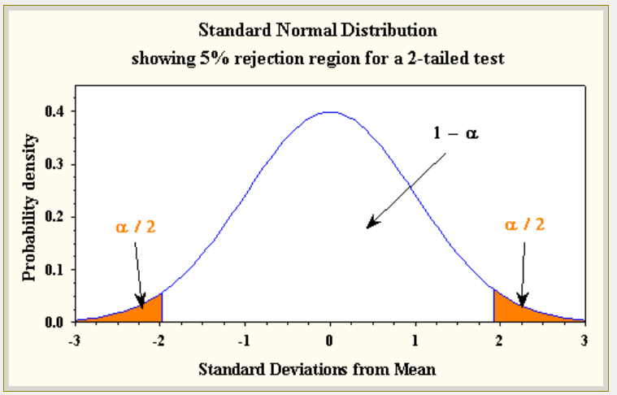
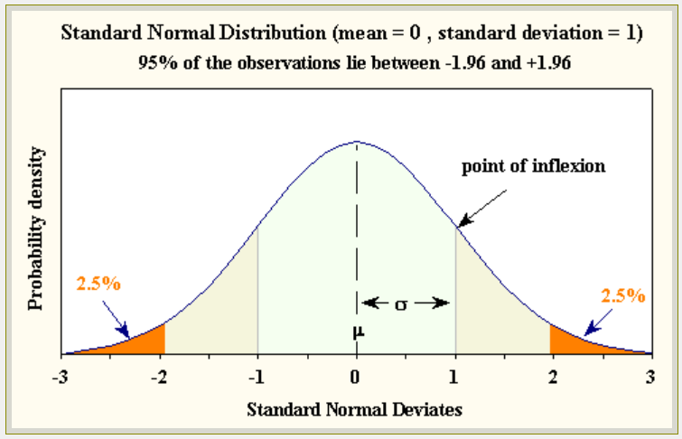

class: front


```{r setup, echo=FALSE, cache = FALSE}
library(knitr)
opts_chunk$set(warning=FALSE,
             message=FALSE,
             echo=TRUE,
             comment = "",
             cache = TRUE, fig.width=10, fig.height=8)
pacman::p_load(tidyverse, kableExtra)
```


```{r xaringanExtra, echo=FALSE}
xaringanExtra::use_animate_css()
xaringanExtra::use_animate_all("fade")
xaringanExtra::use_scribble()
xaringanExtra::use_tile_view()
xaringanExtra::use_search(show_icon = TRUE)
```

.pull-left-wide[
# Estadística Correlacional]

.pull-right-narrow[]

## Inferencia, asociación y reporte


----
.pull-left[

## Juan Carlos Castillo
## Sociología FACSO - UChile
## 2do Sem 2024
## [.orange[correlacional.netlify.app]](https:/correlacional.netlify.app)
]


.pull-right-narrow[
.center[
.content-block-gray[
## .gray[Sesión 5:] 
## .curso[Inferencia 4: Test de hipótesis]]
]
]


---
class: inverse middle center

# ¿Qué hemos visto hasta ahora?


## ... y ¿para qué?

---
class: middle center

---
### ¿Qué puedo decir de la población a partir de mi muestra?

--
.content-box-red[
.center[
.large[# PROBABILIDADES ... de un rango de valores]
]]
--


.pull-left-wide[
# ¿Cómo llego al rango de valores probables de un parámetro poblacional obtenido a partir de **una muestra**?
]

.pull-right-narrow[

]

---
.pull-left[
# Probabilidades

.medium[
- Podemos calcular probabilidades basados en una distribución teórica de ocurrencia de eventos.

- Ej: En teoría, la probabilidad de que salga sello al tirar una moneda es 50%

- Mientras más repetimos el evento, más se van a acercar los resultados (distribución empírica) a la probabilidad del evento (distribución teórica)
]
]
.pull-right[

<br>
```{r echo=FALSE}
# rep1500

#prob teóricas
# Definimos los promedios posibles (1.5, 2, 2.5, ..., 5.5, 6)
promedios_posibles <- seq(1, 6, by = 0.5)

# Calculamos la distribución de probabilidad teórica para cada promedio
# Las probabilidades corresponden a los valores de promedios específicos
probabilidades_teoricas <- c(1/36, 2/36, 3/36, 4/36, 5/36, 6/36, 5/36, 4/36, 3/36, 2/36, 1/36)


# Establecemos la semilla para reproducibilidad
set.seed(123)

# Simulamos 100 repeticiones de dos dados
dados1 <- sample(1:6, 1500, replace = TRUE)
dados2 <- sample(1:6, 1500, replace = TRUE)

# Calculamos el promedio de los resultados de ambos dados
promedio_dados <- (dados1 + dados2) / 2

# Calculamos las frecuencias de cada promedio posible
frecuencias_empiricas <- table(promedio_dados)

# Convertimos las frecuencias a probabilidades
probabilidades_empiricas <- frecuencias_empiricas / sum(frecuencias_empiricas)

# Graficamos las frecuencias de probabilidad empíricas
barplot(probabilidades_empiricas, 
        main = "Frecuencia de Probabilidad del Promedio de Dos Dados (1500 repeticiones)",
        xlab = "Promedio de los Dados",
        ylab = "Frecuencia de Probabilidad",
        col = rgb(0.1, 0.5, 0.8, 0.6), # Azul con transparencia
        ylim = c(0, 0.2))

# Superponemos las barras de la distribución teórica
barplot(probabilidades_teoricas, 
        names.arg = promedios_posibles,
        col = rgb(0.8, 0.2, 0.2, 0.5), # Rojo con transparencia
        add = TRUE)

# Se agrega al gráfico existente
legend("topright", legend = c("Empírica", "Teórica"), 
       fill = c(rgb(0.1, 0.5, 0.8, 0.6), rgb(0.8, 0.2, 0.2, 0.5)),
       border = "white")

rep1500 =recordPlot()        

rep1500
```

]
---
.pull-left[
# Curva Normal

.medium[
- Hay una serie de eventos que en términos teóricos y empíricos tienen una distribución particular en torno al valor central -> **normal**

- La .red[curva normal] es una distribución teórica que nos permite tener un estándar con el cual comparar distribuciones empíricas


]]

.pull-right[
<br>
<br>
<br>

]
---
# Teorema del límite central y error estándar
.pull-left[
.medium[
- si pudiera calcular un estadístico en muchas muestras distintas (ej: promedio) este se distribuiría de manera normal

- el **error** estándar es la formula que nos permite obtener el valor de la desviación estándar de los promedios con una sola muestra
]]

.pull-right[

<br>
# $$\sigma_{\bar{X}}=\frac{s}{\sqrt{N}}$$
]

---
.pull-left[
# Puntajes Z

.medium[
- el puntaje Z es una medida de distancias del promedio en una distribución normal, que tiene promedio 0 y desviación estándar 1

- Z expresa cualquier puntaje en desviaciones estándar desde el promedio (de la curva normal)

- Z permite además  obtener el valor del percentil de cada puntaje 
]]

.pull-right[

# $$z=\frac{x-\mu}{\sigma}$$


]
---
# Intervalos de confianza [para el promedio]
.medium[
.pull-left[

- rango de probabilidad del valor de un parámetro en la población

- Para construirlo, 4 pasos:

  1- establecer **nivel de confianza** (convencionalmente  95%)
  
  2- definir **puntaje Z** correspondiente a este intervalo (para 95% es 1.96)
]
]
--

.medium[
.pull-right[
3- multiplicar Z por el **error estándar**

4 - restar al promedio (límite inferior) y sumar (límite superior)

# $$\bar{X}\pm Z*\frac{\sigma}{\sqrt{N}}$$ 
]
]

---
class: inverse


---
class: inverse  center
<br>
# ¿Qué es una hipótesis?

--

# ¿Cuándo una hipótesis es .yellow[verdadera]?

---
class: roja middle center


# Una .yellow[hipótesis] es una aseveración o una predicción que se desprende de una teoría sobre una situación que ocurre en la población en estudio

---
class: inverse center

#¿Cuándo se puede verificar una hipótesis?

--

# -> .yellow[NUNCA]

--

# ... pero, se puede **.orange[falsar]**
---


.pull-left[
# Popper y la falsabilidad

]

.pull-right[
.medium[
_"el criterio de demarcación que hemos de adoptar no es el de la verificabilidad, sino el de la .red[falsabilidad] de
los sistemas. Dicho de otro modo: no exigiré que un sistema científico pueda
ser seleccionado, de una vez para siempre, en un sentido positivo; pero sí
que sea susceptible de selección en un sentido negativo por medio de contrastes o pruebas empíricas: ha de ser posible refutar por la experiencia un sistema científico empírico" (Popper, 1982, p. 40)_
]
]

---
# Contraste de hipótesis y falsación

.pull-left-narrow[

]

.pull-right-wide[
- El **verificar** una hipótesis no hace que una teoría sea verdadera

- Se puede intentar refutar una teoría (**falsarla**) mediante un contraejemplo o hipótesis contraria

- Si no es posible refutar la hipótesis contraria, entonces la teoría queda aceptada **provisionalmente**
]
  
---
# Ejemplo

.pull-left[
Teoría: todos los cuervos son negros

Hipótesis de verificación: hay cuervos negros

Hipótesis de falsación: hay cuervos blancos
]

.pull-right-narrow[
<br>


]
---
class: inverse center

### Lógica de contraste de hipótesis: 

## .yellow[Intentar falsear lo que es contrario a nuestra hipótesis original]

--

## En estadística, esta "hipótesis contraria" se denomina la .yellow[HIPÓTESIS NULA]


---
class: roja middle center

# buscamos RECHAZAR LA HIPÓTESIS NULA

si logramos rechazar la hipótesis nula (o sea, que lo contrario de nuestra teoría no es verdad), entonces encontramos evidencia a favor de nuestra teoría

Buscamos .large[no encontrar] cuervos blancos 


---
class: center


---
# Tipos de hipótesis

- Según número de variables involucradas: univariadas, bivariadas, multivariadas

- Según tipo de contraste

  - hipótesis de diferencia (distinto de)
  
  - hipótesis de comparación (mayor/menor qué)


-> más detalle de tipos de hipótesis prox. clase, ahora vamos a un **ejemplo**

---
class: inverse middle center
 
 
## ¿Existen diferencias salariales entre hombres y mujeres en Chile?

----

.black[
| Hipótesis general| Hipótesis estadística     |
|---------------------------------------|--------------------------------|------------------------|
| Existen diferencias salariales entre hombres y mujeres     | Hipótesis **alternativa**: Las diferencias son distintas de cero      |
| No existen diferencias salariales entre hombres y mujeres | Hipótesis **nula**: Las diferencias no son distintas de cero         |
]


---
# Cuestionario CASEN

.pull-left[


]

.pull-right[

]

---
# Datos CASEN 2022

.pull-left-narrow[

]

.medium[
.pull-right-wide[

Vamos a generar una submuestra de 350 casos de CASEN para ilustrar de mejor manera el sentido del test de hipótesis

```{r}
pacman::p_load(sjmisc, haven, dplyr, stargazer, interpretCI, kableExtra)
load("casen2022_inf2.Rdata")
options(scipen=999) # para evitar notación en los ceros
set.seed(20) # para fijar el resultado aleatorio
casen_350 <- casen2022_inf %>% select(salario,sexo)  %>% sample_n(350)
casen_350 <- na.omit(casen_350)
```
]]
---
# Datos

```{r}
stargazer(as.data.frame(casen_350), type = "text")
```

---

```{r}
casen_350%>% # se especifica la base de datos
   dplyr::group_by(sexo=sjlabelled::as_label(sexo)) %>% # se agrupan por la variable categórica y se usan sus etiquetas con as_label
  dplyr::summarise(Obs.=n(),Promedio=mean(salario, na.rm=TRUE),SD=sd(salario, na.rm=TRUE)) %>% # se agregan las operaciones a presentar en la tabla
  kable(, format = "markdown") # se genera la tabla
```


Diferencia salarial = 654.585-604.420=**50.165**

---
class: inverse
###  .yellow[Procedimiento: 5 pasos de la inferencia] (ajustados de Ritchey)

1. Formular hipótesis ( $H_0$ y $H_A$)

2. Obtener error estándar y estadístico de prueba empírico correspondiente (ej: Z o t)

3. Establecer la probabilidad de error $\alpha$ (usualmente 0.05) y obtener valor crítico (teórico) de la prueba correspondiente

4. Cálculo de intervalo de confianza / contraste valores empírico/crítico

5. Interpretación

---
# 1. Formular hipótesis

Contrastamos la *hipótesis nula* (no hay diferencias de promedios entre grupos):

$$H_{0}: \bar{X}_{hombres} -  \bar{X}_{mujeres}= 0$$

En referencia a la siguiente hipótesis alternativa:

$$H_{a}: \bar{X}_{hombres} -  \bar{X}_{mujeres} \neq 0$$
---
.content-box-green[
# (2. Error estándar y estadístico de prueba)

- .red[(Una nota preliminar)] En general, existen 2 formas de realizar el contraste de hipótesis: <br> <br>
.medium[
- intervalo de confianza, asociado al error estándar  
- contraste con valor crítico, asociado al estadístico de prueba
  ]
- Ambos entregan información consistente y complementaria

- En esta clase vamos a estimar solo el intervalo, la próxima veremos el contraste con valor crítico, que el caso de diferencia de medias corresponde a la prueba $t$ de student.
]
---
# 2. Error estándar (y estadístico de prueba)

- Cada estadístico tiene su propia fórmula de error estándar

- En el caso de la **diferencia de medias** (en este caso, de hombres y mujeres), el error estándar es:


$$SE=\sqrt{\frac{\sigma_{diff}}{n_a}+\frac{\sigma_{diff}}{n_b}}$$
Donde

$$\sigma_{diff}=\frac{\sigma^2_{a}(n_a-1)+\sigma^2_{b}(n_b-1)}{n_a+n_b-2}$$

- como se puede apreciar, es una extensión del error estandar del promedio pero para dos grupos distintos 

---

Cálculo de la desviación estándar de las diferencias de promedios:

\begin{align*}
\sigma_{diff}&=\frac{468692^2(205-1)+444666^2(138-1)}{205+138-2} \\ \\ 
&=\frac{44813126936256+27088715663172}{341}\\ \\ 
&=210855843400
\end{align*}

---

Y enfonces el error estándar de la diferencia de medias:
\begin{align*}
SE&=\sqrt{\frac{\sigma_{diff}}{n_a}+\frac{\sigma_{diff}}{n_b}} \\ \\
&=\sqrt{\frac{210855843400}{205}+\frac{210855843400}{138}}\\ \\
&=50561
\end{align*}


---
# 3. Establecer probabilidad de error

- asumimos que existe una probabilidad de error al rechazar $H_0$, para lo cual fijamos un límite convencional -> usualmente un 5%

- ¿error **de qué**? -> de rechazar $H_0$ cuando esta existe en la población.  
- Esto se conoce como la **probabilidad de error Tipo  I o $\alpha$ (alfa)**

---
## Hipotesis nula ( $H_0$) y tipos de error
.center[

]

---
# En nuestro ejemplo:

$$H_{0}: \bar{X}_{sueldo\ mujeres} -  \bar{X}_{sueldo\ hombres}= 0$$
- Si **hay** diferencias de sueldo en la población y rechazamos $H_0$: decisión correcta

- Si **no hay** diferencias de sueldo en la población y rechazamos $H_0$: Error tipo I

.content-box-red[
.center[
##El Error Tipo I equivale a encontrar cosas en nuestra muestra que no existen en la población
]]

---
## Hipotesis nula y tipos de error


---
# Hipótesis nula y $\alpha$

- Entonces, el $\alpha$ es la probabilidad de error que fijamos para rechazar la hipótesis nula

- en lenguaje de prueba de hipótesis, es la probabilidad de rechazar la hipótesis nula cuando esta es verdadera

- o la probabilidad de encontrar diferencias entre grupos de la población cuando estas no existen

- o en simple, la probabilidad de que nos estemos equivocando

---
# Nivel de confianza y probabilidad de error  $\alpha$

- el nivel de confianza de una estimación se determina de manera **convencional**, usualmente se acepta 95% o 99% de confianza

- un nivel de confianza se expresa en una probabilidad de error $\alpha$ (.red[alfa]), que es 1- nivel de confianza

  - para un nivel de confianza de 95%, $\alpha=1-0.95=0.05$
  
  - para un nivel de confianza de 99%, $\alpha=1-0.99=0.01$

---
class: middle center



---
class: middle center



---
.content-box-green[

## 4. Intervalo de confianza [y contraste con valor crítico]

- de la clase anterior con prueba Z sabemos que el valor crítico para un 95% de confianza es 1.96 

- para diferencia de medias se utiliza prueba $t$, donde el valor crítico es variable según en tamaño muestral

- sin embargo, para muestras grandes, t=Z, y por lo tanto por ahora mantendremos los valores referenciales Z (de 1.96) hasta que profundicemos en t la próxima clase

]

---
# 4. Intervalo de confianza


\begin{align*}
\bar{x}_1-\bar{x}_2 &\pm t_{\alpha/2}*SE_{\bar{x_1}-\bar{x_2}} \\\\
50165 &\pm 1.96*50561 \\\\
50165 &\pm 99099.56 \\\\
CI[-49287.48&;149617.63]
\end{align*}

---
# Test de hipótesis de diferencias en R

```{r}
t.test(salario ~ sexo, data = casen_350, var.equal=TRUE)
```

---
# tabla t test con `rempsyc`

```{r}
pacman::p_load(rempsyc,broom)
model <- t.test(salario ~ sexo, data = casen_350, var.equal=TRUE)
stats.table <- tidy(model, conf.int = TRUE)
nice_table(stats.table, broom = "t.test")

```
???
https://rempsyc.remi-theriault.com/articles/t-test


---
# 5. Interpretación

Nuestro intervalo de confianza **contiene el cero**, por lo que no se rechaza la hipótesis nula
----
.content-box-red[

Con un 95% de confianza (5% de probabilidad de error) no se encuentra evidencia de diferencias salariales entre hombres y mujeres.

Alternativamente:
No existe evidencia que las diferencias salariales entre hombres y mujeres son distintas de cero, con un 5% de probabilidad de error
]

---
class: inverse

## Resumen

- hipótesis: aseveraciones sobre algo que ocurre en la población, usualmente asociaciones entre conceptos / variables

- las hipótesis se contrastan con un criterio de falsabilidad

- el contraste de hipótesis en estadística opera mediante el rechazo de la hipótesis nula (o de no diferencias), con una probabilidad de error $\alpha$

- 5 pasos para contraste de hipótesis


---
# Próxima clase

- Prueba $t$

- hipótesis direccionales  (mayor o menor qué) o de una cola (one tail)

- inferencia para proporciones

---
# Recomendaciones


[](https://cienciassocialesfcpys.wordpress.com/wp-content/uploads/2016/03/5la-logica-de-las-ciencias-sociales-popper-adorno-dahrendorf-habermas.pdf)

---
class: front


.pull-left-wide[
# Estadística Correlacional]

.pull-right-narrow[]

## Inferencia, asociación y reporte


----
.pull-left[

## Juan Carlos Castillo
## Sociología FACSO - UChile
## 2do Sem 2024
## [.orange[correlacional.netlify.app]](https:/correlacional.netlify.app)
]


.pull-right-narrow[
.center[
.content-block-gray[

]]
]

