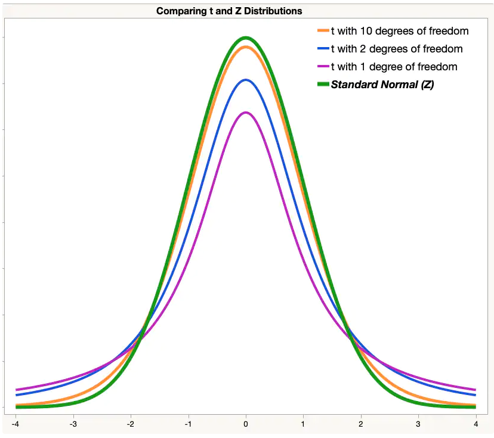
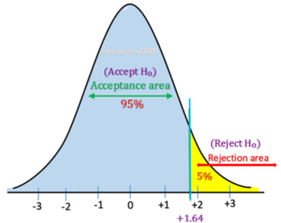

class: front


```{r setup, echo=FALSE, cache = FALSE}
library(knitr)
opts_chunk$set(warning=FALSE,
             message=FALSE,
             echo=TRUE,
             comment = "",
             cache = TRUE, fig.width=10, fig.height=8)
pacman::p_load(tidyverse, kableExtra)
```


```{r xaringanExtra, echo=FALSE}
xaringanExtra::use_animate_css()
xaringanExtra::use_animate_all("fade")
xaringanExtra::use_scribble()
xaringanExtra::use_tile_view()
xaringanExtra::use_search(show_icon = TRUE)
```

.pull-left-wide[
# Estadística Correlacional]

.pull-right-narrow[]

## Inferencia, asociación y reporte


----
.pull-left[

## Juan Carlos Castillo
## Sociología FACSO - UChile
## 2do Sem 2024
## [.orange[correlacional.netlify.app]](https:/correlacional.netlify.app)
]


.pull-right-narrow[
.center[
.content-block-gray[
## .gray[Sesión 6:] 
## .curso[Inferencia 5: Prueba t y direccionalidad]]
]
]

---
class: inverse


---
class: inverse
###  .yellow[Procedimiento: 5 pasos de la inferencia] (ajustados de Ritchey)

1. Formular hipótesis ( $H_0$ y $H_A$)

2. Obtener error estándar y estadístico de prueba empírico correspondiente (ej: Z o t)

3. Establecer la probabilidad de error $\alpha$ (usualmente 0.05) y obtener valor crítico (teórico) de la prueba correspondiente

4. Cálculo de intervalo de confianza / contraste valores empírico/crítico

5. Interpretación

---
# Pendientes: 

- prueba t

- cálculo de valor crítico de prueba para contraste de hipótesis

- hipótesis direccionales (por ejemplo, mayor o menor qué)

---
class: inverse botom right

# Prueba t

---
# Comparación entre grupos 
- gran parte de las hipótesis de investigación se relacionan con **diferencias entre grupos**, ej:

  - hombres obtienen mayor salario que las mujeres
  
  - los chilenos son más prejuiciosos que los migrantes
  
  - ahora se apoyan los cambios más graduales que antes (comparación en el tiempo)
  
---

(sociología y método comparativo)

---
# Comparación de medias

- en análisis cuantitativo, buena parte de las hipótesis comparativas remiten a comparaciones entre promedios

  - ej. clase anterior: el promedio salarial de los hombres es mayor que el de las mujeres
  
- la clase anterior construimos un intervalo de confianza para contrastar esta hipótesis, y para eso utilizamos prueba Z ... lo que no corresponde, pero solo fue a modo de simplificación:

---
# Del ejemplo de la clase anterior (sub muestra CASEN)

```{r echo=FALSE}
pacman::p_load(sjmisc, haven, dplyr, stargazer, interpretCI, kableExtra)
load("casen2022_inf2.Rdata")
options(scipen=999) # para evitar notación en los ceros
set.seed(20) # para fijar el resultado aleatorio
casen_350 <- casen2022_inf %>% select(salario,sexo)  %>% sample_n(350)
casen_350 <- na.omit(casen_350)
```

```{r}
casen_350%>% # se especifica la base de datos
   dplyr::group_by(sexo=sjlabelled::as_label(sexo)) %>% # se agrupan por la variable categórica y se usan sus etiquetas con as_label
  dplyr::summarise(Obs.=n(),Promedio=mean(salario, na.rm=TRUE),SD=sd(salario, na.rm=TRUE)) %>% # se agregan las operaciones a presentar en la tabla
  kable(, format = "markdown") # se genera la tabla
```

Diferencia salarial = 654.585-604.420=**50.165**

---
# Generación de intervalo (con Z)

\begin{align*}
\bar{x}_1-\bar{x}_2 &\pm t_{\alpha/2}*SE_{\bar{x_1}-\bar{x_2}} \\\\
50165 &\pm 1.96*50561 \\\\
50165 &\pm 99099.56 \\\\
CI[-49287.48&;149617.63]
\end{align*}

Asumiendo que el valor Z para un error $\alfa$ de 0.5 (o 95% de confianza) es de **1.96**

El valor de la prueba (en este caso Z) que se define para un determinado nivel de error se denomina **valor crítico**

Para diferencia de medias necesitamos un valor crítico más preciso que el que nos da $Z$, que se denomina el valor $t$.

---
# $t$ y valores críticos

- la distribución t es similar a Z

- se basa en la distribución normal, pero con ajuste para muestras pequeñas y para cuando no conocemos la desviación estándar de la población

- por lo tanto, la forma de la distribucion varía según el tamaño muestral, asociado al concepto de **grados de libertad** 

---
class: middle, center



---
.pull-left[
## Cálculo de valor crítico en Z y t

Recordemos el cáĺculo de valores críticos en Z para construir un intervalo de confianza al 95% (clase Inferencia 3):
]

.pull-right[
.medium[
Límite inferior: 2.5% (0.025)
```{r}
qnorm(0.025) # límite inferior
```

Límite superior: 2.5% + 95% = 97.5% (0.975)
```{r}
qnorm(0.975) # límite superior
```
]
]

Y aproximando, $\pm$ **1.96**

---
- En el ejemplo de la clase anterior, para una diferencia de salarios de 50165, un error estándar de 50561, y un Z de 1.96=


\begin{align*}
\bar{x}_1-\bar{x}_2 &\pm [Z]_{\alpha/2}*SE_{\bar{x_1}-\bar{x_2}} \\\\
50165 &\pm 1.96*50561 \\\\
50165 &\pm 99099.56 \\\\
CI[-49287.48&;149617.63]
\end{align*}

---
# Intervalo de confianza para diferencia de medias con prueba $t$

- la obtención del valor crítico para un determinado nivel de confianza es similar a Z, pero ajustado al tamaño muestral

- el tamaño muestral se asocia al concepto de **grados de libertad**

- la pregunta a responder es: ¿cuál es el valor crítico de $t$ para una probabilidad de error $\alpha$ y grados de libertad $N-2$?

---
.pull-left[

]

.pull-right[
Para esto, tradicionalmente se recurre a la "tabla de valores $t$"

A medida que aumenta la muestra (asociada a DF-grados de libertad), t se aproxima a Z

Como se ve en la tabla, en una muestra de 1000 el valor crítico para 0.025   t=1.96
]

---
# Establecimiento del valor crítico de la prueba (t)

.pull-left[

- para un nivel de error $\alpha=0.05$

- y una hipótesis de diferencia de dos colas: $\alpha/2=[0.025-0.975]$

- grados de libertad N-2= 343-2 = 341]

.pull-right[
.medium[
```{r}
qt(p=.05/2, df=341)
```

```{r}
qt(p=.05/2, df=341, 
   lower.tail=FALSE)
```

Como vemos, es un poco mayor a Z pero parecido, ya que la muestra es de buen tamaño
]]

---
# Construcción de intervalo de confianza para diferencia de medias en base a prueba $t$

\begin{align*}
\bar{x}_1-\bar{x}_2 &\pm t_{\alpha/2}*SE_{\bar{x_1}-\bar{x_2}} \\\\
50165 &\pm 1.967*50561 \\\\
50165 &\pm 99453.49 \\\\
CI[-49288.49&\ ;149618.5]
\end{align*}

---
# Prueba $t$ y test de hipótesis

.pull-left[
.medium[
- además de la construcción de intervalos, otra forma más tradicional de contraste de hipótesis para diferencia de medias es la prueba $t$

- la prueba $t$ consiste en el contraste de un _valor crítico_ de $t$  con un _valor empírico_ $t$ (o simplemente $t$) con la siguiente fórmula: 
]]

.pull-right[
## $t=\frac{(\bar{x}_1-\bar{x}_2)}{\sqrt{\frac{s_1²}{\sqrt{n_1}}+\frac{s_2²}{\sqrt{n_2}} }}$

El denominador es el .red[error estándar de la diferencia de promedios] (que vimos la clase pasada)]

---

.pull-left-narrow[Este t se compara con un valor crítico (teórico) de t asociado a una probabilidad de error $\alpha$, ej: 0.05

Si el t empírico es igual o superior al crítico se rechaza $H_0$ ]

.pull-right-wide[

]

---
# En nuestro ejemplo:

Para una diferencia de salarios de 50165, un error estándar de 50561

## $t=\frac{(\bar{x}_1-\bar{x}_2)}{\sqrt{\frac{s_1²}{\sqrt{n_1}}+\frac{s_2²}{\sqrt{n_2}} }}=\frac{50165}{50561}=0.9921$

Este valor $t$ (empírico) se contrasta con el valor crítico correspondiente a un 5% de probabilidad de error 

---

En este contraste se compara el valor estimado del estadístico de prueba y sus valores críticos:

$$t_{cri}= -1.96 < t_{est}=0.992 < t_{cri}= 1.96$$
Por lo tanto, nuestro valor estimado queda fuera de la zona de rechazo de la hipótesis nula. 

En consecuencia, con un nivel de confianza de 95% no podemos afirmar que existen diferencias salariales entre hombres y mujeres

---

.pull-left-wide[
```{r echo=FALSE}
pacman::p_load(gginference)
ggttest(t.test(
  salario ~ sexo, 
  data = casen_350, 
  var.equal=TRUE)) +
  theme(
    text = element_text(size = 20))
```
]


.pull-right-narrow[
.medium[
<br>
<br>
<br>
<br>
<br>
<br>
<br>
El gráfico muestra nuestro valor estimado de t fuera de la zona de rechazo (zona gris en la curva). Por lo tanto, no podemos rechazar $H_0$, las diferencias no son distintas de cero 
]
]

---
# $t$ y $p$

- el cálculo de $t$ (estimado) nos da un valor en la curva, que puede ser transformado al valor de probabilidad de área bajo la curva (tal como en Z)

- _cual es la probabilidad de error (valor p) de un $t$ específico?_

- esto también se puede ver en una tabla de valores $t$ y sus respectivas probabilidades

- y en  R ...

---


```{r eval=FALSE}
(qt(t,df, lower.tail = FALSE))*2
```
Donde:
- qt: función que entrega la probabilidad para un valor $t$

- df: grados de libertar (degrees of freedom)
- lower.tail=FALSE: considera las probabilidades acumuladas hacia la cola superior de la curva

- *2: al ser una prueba de diferencias, considera zona de rechazo en ambas direcciones de la curva, por lo que las probabilidades se multiplican por 2

---
En nuestro ejemplo:

```{r}
(pt(0.99215, 341, lower.tail = FALSE))*2
```

- La probabilidad de error del $t$ estimado es de 0.322. 

- Esto quiere decir es que en la estimación de esta diferencia de medias, nos estamos equivocando aproximadamente un tercio de las veces

- Esta probabilidad está lejos del límite convencional de probabilidad de error  de 0.05, por lo que se rechaza la hipótesis nula

---
class: inverse, middle, center

# A mayor valor $t$, menor probabilidad de error $p$ 

---
# Test de hipótesis: insumos complementarios

Entonces, se logra rechazar la hipótesis nula cuando:

- el intervalo de confianza no contiene el 0

- ### $t_{estimado} > t_{crítico}$

- ### $p_{estimado} < p_{crítico}$, 


  - o en términos generales convencionales, p<0.05

---
# Test de hipótesis de diferencias en R

```{r}
t.test(salario ~ sexo, data = casen_350, var.equal=TRUE)
```

---
# tabla t test con `rempsyc`

```{r}
pacman::p_load(rempsyc,broom)
model <- t.test(salario ~ sexo, data = casen_350, var.equal=TRUE)
stats.table <- tidy(model, conf.int = TRUE)
nice_table(stats.table, broom = "t.test")

```
???
https://rempsyc.remi-theriault.com/articles/t-test

---
# Reporte formato APA

_"Se realizó una prueba t para muestras independientes para comparar los salarios entre hombres y mujeres. Los resultados indicaron una diferencia no significativa en los salarios entre hombres (M = 654585, SD = 468692) y mujeres (M = 604420, SD = 444666); t(341)=0.9921, p=0.321. El intervalo de confianza del 95% para la diferencia de medias fue [−49288.49;149618.5]._

[diferencia no significativa=no se logra rechazar $H_0$]

---
# En R con librería `report`

```{r results='hide'}
model <- t.test(salario ~ sexo, data = casen_350, var.equal=TRUE)
report(model)
```

_La prueba t de dos muestras que evalúa la diferencia de salario según sexo (media en el grupo 1 = 654585, media en el grupo 2 = 604420) sugiere que el efecto es positivo, estadísticamente no significativo y muy pequeño (diferencia = 50165, IC del 95% [-49,287.48, 150,000], t(341) = 0.99, p = 0.322)._

.small[[traducido y con mínima edición]]

---
class: inverse bottom right
# Hipótesis direccionales

---
## Tipos de preguntas e hipótesis (ej: con promedio(s))
----

.small[

| **Pregunta**| **Hipotesis**   | **Prueba**
|---------------------|------------------------------------------------------|
| A. ¿Existe el promedio en la población?  <br>  | $$H_{a}: \bar{X}_1 \neq 0$$  $$H_{0}: \bar{X}_1 = 0$$    | Dos colas (no direccional)
| B. ¿Existen diferencias de promedios en la población? | $$H_{a}: \bar{X}_1 -  \bar{X}_2 \neq 0$$  $$H_{0}: \bar{X}_1 -  \bar{X}_2= 0$$    | Dos colas (no direccional)
| C. ¿Es un promedio (1) superior (o inferior) al otro (2)?         | $$H_{a}: \bar{X}_1 -  \bar{X}_2 \gt 0$$  $$H_{0}: \bar{X}_1 -  \bar{X}_2 \leq 0$$ | Una cola (direccional)
  - ]

---
class: center middle


---
class: middle

.pull-left[

]

.pull-right[
Si bien en teoría las hipótesis direccionales se pueden plantear en ambas direcciones, en general (y por simpleza) se expresan en términos de "mayor que", quedando la zona de rechazo de $H_0$ a la derecha
]

---
## Pasos en test de hipótesis

1. Formulación: El salario de los hombres (grupo 1) es mayor al de las mujeres (grupo 2) 

\begin{align*}
H_{a}: \bar{X}_1 \gt  \bar{X}_2 \\
H_{0}: \bar{X}_1 \leq  \bar{X}_2
\end{align*}

2.Obtener error estándar y estadístico de prueba (lo mismo que para al caso anterior)

 $$t=\frac{(\bar{x}_1-\bar{x}_2)}{\sqrt{\frac{s_1²}{\sqrt{n_1}}+\frac{s_2²}{\sqrt{n_2}} }}=\frac{50165}{50561}=0.9921$$
---
3.Probabilidad de error y valor crítico

- seguimos con probabilidad de error ( $\alpha$ 0.05), pero a diferencia de las no-direccionales no se divide entre 2 (colas), sino que es solo para una

.center[

]


---
3.Probabilidad de error y valor crítico

.pull-left[

- para un nivel de error $\alpha=0.05$ (de una cola)

- grados de libertad N-2= 343-2 = 341
]

.pull-right[
```{r}
qt(p=.05, 
   df=341,
   lower.tail = FALSE)
```

[lower.tail=FALSE se refiere que el calculo refiere a la cola superior]

]

---
4.Contraste

.pull-left[
- Recordemos nuestra hipótesis nula:

$$H_{0}: \bar{X}_{hombres} \leq  \bar{X}_{mujeres}$$
- Considerando los valores de contraste:
$$t_{estimado}=0.992 < t_{critico}=1.6$$

]

.pull-right[

```{r echo=FALSE, results='hide'}
model_dir <- t.test(salario ~ sexo, data = casen_350, alternative="greater", var.equal=TRUE, conf.level = 0.95)
stats.table3 <- tidy(model_dir)
nice_table(stats.table3, broom = "t.test")
directional <- ggttest(model_dir)
```
```{r echo=FALSE}
directional
```

]
---

## 5. Interpretación

.small[
```{r echo=FALSE}
nice_table(stats.table3, broom = "t.test")
```
]

_"Se realizó una prueba t para muestras independientes para examinar si el salario promedio de los hombres (M = 654585, SD = 468692) es mayor que el de las mujeres (M = 604420, SD = 444666), siendo la diferencia entre ambos de 50.165. Los resultados no fueron estadísticamente significativos, t(341)=0.9921, p=0.161. Por lo tanto, con un 95% de confianza no se puede rechazar la hipótesis nula, lo que no permite sustentar la hipótesis inicial (alternativa) que el salario de los hombres es mayor que el de las mujeres."_

???
Nota: en el práctico cambiar el N de la muestra y establecer distintos niveles de confianza

---
class: inverse middle center
# ¿Qué habría pasado con un tamaño muestral más grande, y/o con un nivel de probabilidad de error distinto?
---
# sub-muestra CASEN 1500 casos
```{r echo=FALSE}
pacman::p_load(sjmisc, haven, dplyr, stargazer, interpretCI, kableExtra)
load("casen2022_inf2.Rdata")
options(scipen=999) # para evitar notación en los ceros
set.seed(20) # para fijar el resultado aleatorio
casen_1500 <- casen2022_inf %>% select(salario,sexo)  %>% sample_n(1500)
casen_1500 <- na.omit(casen_1500)
```
```{r}
casen_1500%>% # se especifica la base de datos
   dplyr::group_by(sexo=sjlabelled::as_label(sexo)) %>% # se agrupan por la variable categórica y se usan sus etiquetas con as_label
  dplyr::summarise(Obs.=n(),Promedio=mean(salario, na.rm=TRUE),SD=sd(salario, na.rm=TRUE)) %>% # se agregan las operaciones a presentar en la tabla
  kable(, format = "markdown") # se genera la tabla
```

---
.medium[
.pull-left[
```{r}
model_dir2 <- t.test(
  salario ~ sexo, 
  data = casen_1500, 
  alternative="greater", 
  var.equal=TRUE, 
  conf.level = 0.95)
stats.table4 <- tidy(model_dir2)
nice_table(stats.table4, 
           broom = "t.test")
```
]
]
.pull-right[
```{r echo=FALSE}
directional2 <- ggttest(model_dir2)
directional2
```
]

---

Más como esto: Práctico 2 (o _intentando rechazar_)

---

# Pendientes: hipótesis para proporciones, se verá en la próxima unidad en asociación entre variables categóricas


---
class: middle center


---
class: front


.pull-left-wide[
# Estadística Correlacional]

.pull-right-narrow[]

## Inferencia, asociación y reporte


----
.pull-left[

## Juan Carlos Castillo
## Sociología FACSO - UChile
## 2do Sem 2024
## [.orange[correlacional.netlify.app]](https:/correlacional.netlify.app)
]


.pull-right-narrow[
.center[
.content-block-gray[

]]
]

