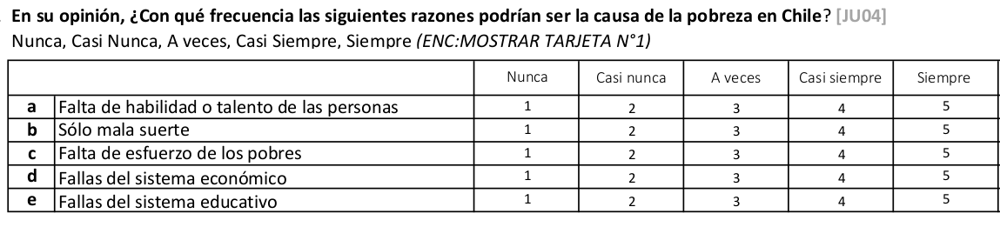
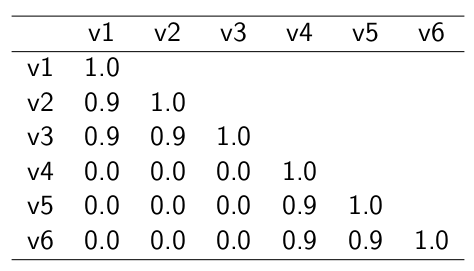

class: front


```{r setup, echo=FALSE, cache = FALSE}
library(knitr)
opts_chunk$set(warning=FALSE,
             message=FALSE,
             echo=TRUE,
             comment = "",
             cache = TRUE, fig.width=10, fig.height=8)
pacman::p_load(tidyverse, kableExtra, flipbookr)
```


```{r xaringanExtra, echo=FALSE}
xaringanExtra::use_animate_css()
xaringanExtra::use_animate_all("fade")
xaringanExtra::use_scribble()
xaringanExtra::use_tile_view()
xaringanExtra::use_search(show_icon = TRUE)
```

.pull-left-wide[
# Estadística Correlacional]

.pull-right-narrow[]

## Inferencia, asociación y reporte


----
.pull-left[

## Juan Carlos Castillo
## Sociología FACSO - UChile
## 2do Sem 2024
## [.orange[correlacional.netlify.app]](https:/correlacional.netlify.app)
]


.pull-right-narrow[
.center[
.content-block-gray[
## .gray[Sesión 10:] 
## .curso[Correlación en ordinales, matrices e índices.]]
]
]
---

layout: true
class: animated, fadeIn

---
class: inverse bottom right


# Correlación con variables ordinales


---
# Coeficiente de correlación de Spearman 

  - se utiliza para variables ordinales y/o cuando se se violan supuestos de distribución normal
  
  - es equivalente a la correlación de Pearson del ranking de las observaciones analizadas 
  
  - es alta cuando las observaciones tienen un ranking similar
  

---
# Cálculo Spearman

- se le asigna un número de ranking a cada valor 

- el valor más bajo obtiene el mayor ranking, y el más alto el menor

- en caso de valores repetidos se produce un "empate", y entonces el ranking se promedia.

---
# Ejemplo: variable Educación


```{r, echo=F}
# Datos ejemplo
id <- seq(1,8)
educ <-c(2,3,4,4,5,7,8,8)
ing <-c(1,3,3,5,4,7,9,11)
data <-data.frame(id,educ,ing)

data$mean_educ <- mean(data$educ)
data$dif_m_educ <- data$educ-data$mean_educ  
data$dif_m_educ2 <- (data$dif_m_educ)^2
data$mean_ing <- mean(data$ing)
data$dif_m_ing <- data$ing-data$mean_ing 
data$dif_m_ing2 <- (data$dif_m_ing)^2
data$dif_xy <-
  data$dif_m_educ*
  data$dif_m_ing


```


.medium[
.pull-left-narrow[
```{r}
data$educ
```

Como estos valores están ordenados de menor a mayor, entonces en principio los valores de ranking serían:

`8 7 6 5 4 3 2 1`.
]

.pull-right-wide[

<br>
<br>

Pero, hay un par de empates

  - el valor 4 está repetido y corresponden a los ranking 6 y 5, por lo tanto a ambos se les asigna el promedio de estos rankings: 5,5

  - lo mismo sucede con el valor 8 en los rankings 2 y 1, por lo tanto a ambos se les asigna el valor 1,5 ]

]

```{r, include=FALSE}
data_spr <- data %>% dplyr::select (educ, ing) %>% mutate(., educ_rank=c(8,7,5.5,5.5,4,3,1.5,1.5)) %>% mutate(., ing_rank=c(8,6.5,6.5,4,5,3,2,1))
```

---

`r chunk_reveal(chunk_name="spearman")`

```{r spearman, include=FALSE, echo=F}
data %>% 
  select (educ, ing) %>% 
  mutate(., educ_rank=c(8,7,5.5,5.5,4,3,1.5,1.5)) %>% 
  mutate(., ing_rank=c(8,6.5,6.5,4,5,3,2,1))

cor(data_spr$educ_rank, data_spr$ing_rank)
```


---
Cálculo directo en `R`:

```{r}
cor.test(data$educ, data$ing, "two.sided", "spearman")
```

---
class: roja middle center

## El coeficiente de correlación de Spearman no es más que una correlación de Pearson del ranking de las variables


---
# Coeficiente de correlación Tau de Kendall

.pull-left[
- Recomendado cuando hay un set de datos pequeños y/o cuando hay mucha repetición de observaciones en el mismo ranking

- Se basa en una comparación de pares de observaciones concordantes y discordantes 

]

--

.pull-right[

En `R`:

.small[
```{r echo=TRUE}
cor.test(data$educ, data$ing,
         "two.sided", 
         "kendall")
```
]
]

---
class: inverse 
## Recomendaciones generales

- Pearson es el coeficiente de correlación por defecto

- En caso de datos en escala de medición ordinal se puede aplicar Spearman (aunque Pearson es también aceptado en este contexto).

- Kendall se reporta en casos muy específicos donde hay un set de datos pequeños y repetición de observaciones en el mismo ranking ("empates")


---
class: inverse bottom right


# Matrices de correlación

---
# Matriz de correlación

- una matriz de correlación se conforma cuando se representa simultaneamente más de un par de asociaciones bivariadas


--

- por ejemplo, si agregamos la variable edad a nuestra base de datos:

```{r}
data$edad <- c(50, 65, 27, 15, 40, 22, 25, 38)
```

Tenemos .red[3 variables], y por lo tanto los siguentes pares de correlaciones posibles: ingreso-educación, ingreso-edad, y educación-edad


---

`r chunk_reveal(chunk_name="matriz1")`

```{r matriz1, include=FALSE, echo=F}
cor_mat <- data %>% 
  select(educ, ing, edad)   %>%
  cor(.)
cor_mat
round(cor_mat, 3)
sjPlot::tab_corr(cor_mat)
```


---
# Matriz de correlación(es)

- tabla de doble entrada donde las variables se presentan tanto en las filas como en las columnas

--

- el coeficiente de correlación correspondiente al par de variables aparece en la intersección de las columnas

--

- existe información redundante

  - las correlaciones se repiten, dado que las variables se intersectan dos veces en la tabla
  - la diagonal tiene solo unos (1), ya que es la correlación de la variable consigo misma

---

`r chunk_reveal(chunk_name="matriz2", title="# Ajustando tabla sjPlot::tab_corr" )`

<br>

```{r matriz2, include=FALSE, echo=F}

sjPlot::tab_corr(cor_mat,
  triangle = "lower",
  title = "Tabla de correlaciones del ejemplo"
  )
```

---

`r chunk_reveal(chunk_name="matriz3", title="# Matriz con librería  corrplot")`

```{r matriz3, eval = F, echo = F}
library(corrplot)
corrplot(cor_mat) 
```

---

`r chunk_reveal(chunk_name="matriz31", title="# Matriz con librería  corrplot")`

```{r matriz31, eval = F, echo = F}
corrplot(cor_mat,
  method = 'number')
```

---

`r chunk_reveal(chunk_name="matriz4", title="# corrplot")`

```{r matriz4, eval = F, echo = F, fig.width=2, fig.height=2}
corrplot(cor_mat, 
  method = 'number', 
  type = 'lower', 
  number.cex = 3,
  tl.cex = 3,
  diag = FALSE)
```

---

`r chunk_reveal(chunk_name="matriz5", title="# corrplot.mixed")`

```{r matriz5, eval = F, echo = F, fig.width=2, fig.height=2}
corrplot.mixed(cor_mat, 
  lower = "number",
  upper = "circle",
  number.cex = 3,
  tl.cex = 3,
  diag = "n")
```

---

`r chunk_reveal(chunk_name="matriz6", title="# corrplot.mixed")`

```{r matriz6, eval = F, echo = F, fig.width=2, fig.height=2}
corrplot(cor_mat, 
  type = "lower",
  addCoef.col = 'white',
  number.cex = 3,
  tl.cex = 3,
  diag = FALSE)
```

---

`r chunk_reveal(chunk_name="matriz7", title="# corrplot.mixed")`

```{r matriz7, eval = F, echo = F, fig.width=2, fig.height=2}
corrplot(cor_mat, 
  type = "lower",
  addCoef.col = 'white',
  number.cex = 3,
  tl.cex = 3,
  diag = FALSE,
  method = 'square')
```

---
class: inverse bottom right

# Correlaciones, matrices, y casos perdidos

---
# Consideraciones sobre casos perdidos 

- Cuando hay casos perdidos en las variables, ¿cuál es el número de casos de la matriz de correlaciones? 

- Las correlaciones bivariadas se calculan con información completa, por lo tanto si hay un dato perdido en una de las variables se elimina el caso completo

- Algunas funciones lo hacen de manera automática, en otras hay que especificarlo previamente

---
# Ejemplo

Agreguemos un caso perdido (NA en R) a una de nuestras variables

```{r}
data$edad
data$edad <-replace(data$edad, data$edad==15, NA)
data$edad
```

---
.medium[
```{r}
cormat_NA <- data %>% select(educ, ing, edad) %>% cor(.)
round(cormat_NA,3)
```
```{r}
cormat_listwise <- data %>% select(educ, ing, edad) %>% 
  cor(., use = "complete.obs")
round(cormat_listwise, 3)
```
]


---
# Eliminación de casos perdidos por lista (o listwise)

- las correlaciones bivariadas requieren eliminación de casos perdidos tipo listwise, es decir, si hay un dato perdido en una variable se pierde el caso completo

- Para conocer el número de casos con que se calculó la matriz:

.medium[
```{r}
sum(complete.cases(data))
```
]

Por lo tanto, en el cálculo se perdió el caso o fila completa de la base (de 8 casos) que tenía el caso perdido.

---
# Eliminación de casos perdidos por pares (o pairwise)

- en el caso de las matrices de correlaciones es posible tomar la opción .red[pairwise] para casos perdidos

- pairwise quiere decir que se eliminan los casos perdidos solo cuando afectan al cálculo de un **par específico**.

---
# Eliminación de casos perdidos por pares (o pairwise)

- en el caso de nuestro ejemplo, si consideramos listwise todas las correlaciones tienen 7 casos, pero con pairwise la correlación entre educación e ingreso mantendría 8 casos.

- por lo tanto, **pairwise permite mayor rescate de información y mayor N en el cálculo de matrices de correlaciones**

---
# Opción pairwise en correlación en R

```{r}
data %>% select(educ, ing, edad) %>% 
  cor(., use = "pairwise")
```
En este caso vemos una leve variación en el coeficiente comprometido (educ-ing) comparando listwise con pairwise


---
# Número de casos pairwise
```{r}
data %>% select(educ,ing,edad) %>% psych::pairwiseCount() 
```
Se indica que en las correlaciones con edad se utilizaron 7 casos, mientras en la correlación entre ingreso y educación se utilizan 8 casos con el método pairwise

---
class: inverse bottom right

# Baterías, matrices y consistencia

---
class: middle center

.center[

]


---
class: middle

.pull-left-narrow[
# Preguntas y error de medición
]
.pull-right-wide[
.content-box-yellow[
-   Para medir hechos observables simples usualmente se utiliza **una
    pregunta** (ej: edad)

-   Fenómenos complejos se miden en general con más de una pregunta, con
    el objetivo de dar mejor cuenta del atributo (i.e. minimizar error
    de medición)
]]


---
# Baterías de indicadores múltiples

- en general las encuestas suelen incluir varias preguntas respecto de un mismo tema -> .red[baterías de indicadores múltiples]

--

- cubren distintos aspectos de un mismo fenómeno complejo que no se agota en solo un indicador -> minimiza .red[error de medición]

--

- .red[problema]: ¿cómo se analizan indicadores que están relacionados?¿cómo se muestran los resultados?

---
# Análisis de indicadores en baterías

.pull-left-narrow[
1. .red[Univariado]: se sugiere presentar análisis descriptivos que contengan todos los indicadores para poder comparar frecuencias
]

.pull-right-wide[
.center[

.small[(likert plot, `sjPlot`)]
]
]

---
# Análisis de indicadores en baterías

.pull-left-narrow[

2\. .red[Bivariado]: tablas/gráficos de correlaciones

(`corrplot`)
]

.pull-right-wide[
.center[


]
]

---
# Análisis de indicadores en baterías

- Se podría asumir un concepto o .red[dimensión subyacente] a la batería de items

- Para facilitar el avance en el análisis (por ejemplo, relacionar ese concepto subyacente con otras variables), muchas veces se reduce la batería a algún .red[tipo de índice (sumativo/promedio)]

- ¿Podemos asegurar que los items están realmente .red[midiendo lo mismo]?

---
## ¿Miden lo mismo?

.center[

]

---
class: middle

.pull-left-narrow[
# Preguntas y error de medición
]

.pull-right-wide[
.content-box-red[
-   En este marco se asume que el **indicador es distinto del atributo**, y que la medición del atributo o variable latente conlleva error

-   Cuando la el atributo se mide con más de una pregunta, se puede
    intentar estimar la **variable latente** mediante índices o           técnicas de **análisis factorial**
]]

---
# Medición y error
.pull-left[

.center[

]
]

.pull-right[
- antes de agrupar indicadores en un índice hay que evaluar si los indicadores se encuentran relacionados

  - -> si miden constructos similares
  - -> si la medición es .red[confiable]
]

---
class: inverse center

<br>
.content-box-red[
## .red[¿Cómo estimar el nivel de relación entre indicadores que miden un mismo constructo?]
]
--

### Distintas maneras, pero todas se basan en la técnica de la .red[correlación]

---
# Matriz de correlaciones (1)

.center[
  

Matriz hipotética de indicadores que miden un mismo constructo

]

---
# Ej. Matriz de correlaciones (2)

.center[
  

Matriz hipotética de indicadores que miden constructos independientes
]

---
# Ej. Matriz de correlaciones (3)

.center[
  

Matriz hipotética de variables que miden dos constructos independientes]

---
class: inverse

## .yellow[Entonces:]

### 1. analizar la .red[matriz de correlaciones] antes de generar cualquier técnica de reducción de información (ej: crear índice)

### 2. evaluar la posibilidad de generación algún tipo de .red[índice] que resuma la información
---
# Datos ejemplo

- batería atribuciones de pobreza, encuesta "Desigualdad, Justicia y Participación Política" - FONDECYT Iniciación 11121203 (2013-2015) [Social justice and citizenship participation](https://jc-castillo.com/project/fondecyt-iniciacion/)

.center[

]

---

```{r echo=FALSE}
pacman::p_load(sjmisc,lavaan,haven,dplyr,sjPlot, sjlabelled, summarytools, psych)
```

.small[
```{r echo=FALSE, results='asis'}
load("data/atribpob.RData")
sjmisc::descr(data,
      show = c("label","range", "mean", "sd", "NA.prc", "n"))%>%
      kable(.,"markdown")
```
]


---
## Matriz de correlaciones


```{r}
cormat <- cor(data)
cormat

```

Esta función no resulta ya que requiere que no existan casos perdidos
---
## Matriz de correlaciones

Entonces:

```{r}
cormat <- cor(na.omit(data))
cormat

```

---
## Matriz de correlaciones (Formato publicable)

.tiny[
```{r}
tab_corr(data)
```
]

---


.pull-left-narrow[
## Matriz de correlaciones - gráfico

```{r eval=FALSE}
corrplot(cormat)
```
]

.pull-left-wide[
```{r echo=FALSE}
corrplot::corrplot(cormat)
```

]
---
.pull-left-narrow[
## Matriz de correlaciones - gráfico ajustado
.small[
```{r eval=FALSE}
  corrplot::corrplot(cormat,
    method = "color",
    addCoef.col = "#000390",
    type = "upper",
    tl.col = "black",
    col=colorRampPalette(c("white","#0068DC"))(8),
    bg = "white",
    na.label = "-")
```
]]

.pull-right-wide[
.center[
```{r echo=FALSE, fig.height=8}
  corrplot::corrplot(cormat,
    method = "color",
    addCoef.col = "#000390",
    type = "upper",
    tl.col = "black",
    col=colorRampPalette(c("white","#0068DC"))(8),
    bg = "white",
    na.label = "-")
```
]
]

---
class: inverse bottom right

## .red[Hacia la construcción de un índice]

---
# Alpha de Cronbach

- índice de consistencia interna de una batería

- en general, interpretable como la correlación [absoluta] promedio entre distintas variables que componen una batería de medición 

- varía entre **0 y 1**; valores más cercanos a 1 indican mayor consistencia

- en general valores sobre 0.6 se consideran aceptables


---
# Alpha de Cronbach

.pull-left[
- funcion alpha de la librería `psych`

- se genera un objeto (lo llamaremos alpha). Contiene bastante información, por ahora nos enfocaremos solo en el valor de alpha (`raw_alpha`)
]
.pull-right[
.small[
```{r warning=FALSE}
names(data)
alpha <-psych::alpha(data)
alpha$total$raw_alpha
```
]
]
---
# Alpha de Cronbach

- puntaje 0.43, por lo tanto bajo los valores aceptables de consistencia interna

- esto ya se podía anticipar desde la matriz de correlaciones, que aparentemente mostraba dos dimensiones subyacentes a la batería

- además, se genera un mensaje de advertencia sobre posibles items codificados a la inversa (dada la correlación entre items de dimensiones distintas)

---
# Opciones

- construcción de índices basados en la información de la matriz de correlaciones

- análisis factorial


---
class: inverse bottom right
# .red[Construcción de índices]

---
# Índice promedio

- vamos a generar 2 índices a partir de esta batería: uno para atribución interna (falthab,faltesf,malasue) y otro para externa (sisecon,siseduc)

- tema valores perdidos:
  - para perder el mínimo de casos se recomienda realizar índice aún con casos que no hayan respondido algún item
  - ya que esto distorsionaría el puntaje si fuera sumado, se hace un índice promedio, especificando que se calcule aún con valores perdidos

---
Indice de atribución interna y externa (promedios)

```{r}
data <- cbind(data, "interna_prom"=rowMeans(data %>% select(falthab,faltesf,malasue), na.rm=TRUE))

data <- cbind(data, "externa_prom"=rowMeans(data %>% select(sisecon,siseduc), na.rm=TRUE))

names(data)

```


---
class: inverse
## _Resumen_

.medium[

### - Correlación de Spearman: apropiada para variables ordinales, equivale a la correlación de Pearson del ranking de las variables

### - Matriz de correlaciones: forma tradicional de reporte de asociaciones de las variables de una investigación, importante considerar tratamiento de datos perdidos (listwise o pairwise)
]

### - Índices y consistencia interna en matrices

---
class: front

.pull-left-wide[
# Estadística Correlacional]

.pull-right-narrow[]

## Inferencia, Asociación y reporte

----
.pull-left[

## Juan Carlos Castillo
## Sociología FACSO - UChile
## 2do Sem 2024
## [.orange[correlacional.netlify.com]](https://encuestas-sociales.netlify.com)
]
    


<!-- adjust font size in this css code chunk for flipbook, currently 80 -->

```{css, eval = FALSE, echo = FALSE}
.remark-code{line-height: 1.5; font-size: 80%}

@media print {
  .has-continuation {
    display: block;
  }
}

code.r.hljs.remark-code{
  position: relative;
  overflow-x: hidden;
}


code.r.hljs.remark-code:hover{
  overflow-x:visible;
  width: 500px;
  border-style: solid;
}
```


