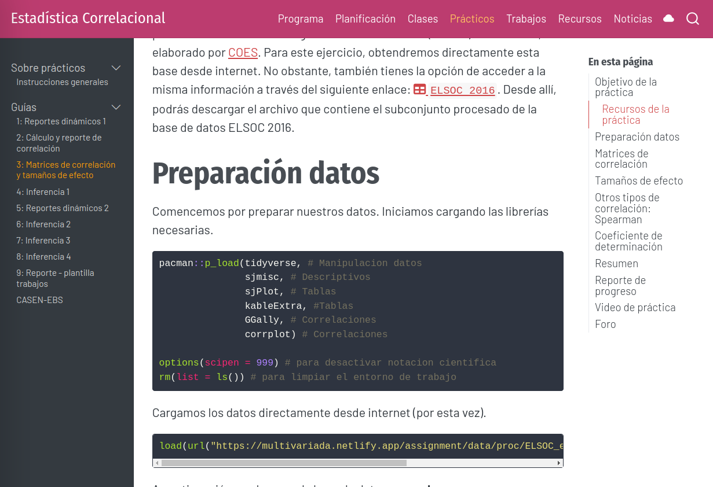

class: front


```{r setup, include=FALSE, cache = FALSE}
library(knitr)
opts_chunk$set(warning=FALSE,
             message=FALSE,
             echo=TRUE,
             comment = "",
             cache = TRUE, fig.width=10, fig.height=8)
pacman::p_load(flipbookr, tidyverse, kableExtra)
```


```{r xaringanExtra, include=FALSE}
xaringanExtra::use_xaringan_extra(c("tile_view", "animate_css"))
xaringanExtra::use_scribble()
```

.pull-left-wide[
# Estadística Correlacional]

.pull-right-narrow[]

## Asociación, inferencia y reporte

----
.pull-left[

## Juan Carlos Castillo
## Sociología FACSO - UChile
## 2do Sem 2023 
## [.orange[correlacional.netlify.com]](https:/correlacional.netlify.com)
]


.pull-right-narrow[
.center[
.content-block-gray[
## Sesión 10: 
## .orange[Cierre]]
]
]

---

layout: true
class: animated, fadeIn

---
# Ciclo de formación en métodos cuantitativos


---
class: middle

.pull-left[
.content-box-red[
.center[
# Imaginación sociológica

Relación del individuo con la sociedad y con la historia

Individuos en contexto social

(C.Wright Mills)]
]
]
.pull-right[
.center[
.content-box-green[
# Imaginación estadística

Una apreciación de que tan usual o inusual es un evento, circunstancia o comportamiento, en relación con un conjunto mayor de eventos similares

(Ritchey, 2008)
]
]]

---

.pull-left[
# Estadística:
"Rama de la matemática que utiliza grandes conjuntos de datos numéricos para obtener inferencias basadas en el cálculo de probabilidades". (RAE)]

--

.pull-right[

# Dos características: 

- **humildad**: la inferencia siempre posee una probabilidad de error

- **pretensión**: podemos medir y establecer qué grado de error estamos cometiendo
]

---
# Organización general

.center[

]

---
# Organización semanal 
  

---
Nuestra página



---
class: roja

# Breve resumen

---
# Unidad 1: Asociación y correlación

- correlación: medida estandarizada que va entre -1 y +1, donde 0 significa ausencia de asociación

- la correlación captura relaciones lineales

- su magnitud se evalúa mediante criterios de Cohen y coeficiente de determinación

- existen coeficientes de correlación alternativos para variables ordinales

- usualmente se presentan en **matrices** 

---
# Unidad 2: Inferencia

- de la muestra a la población

- error estándar y distribuciones muestrales

- contraste de hipótesis: 
  - direccionales y no direccionales
  - hipótesis alternativa y nula
  - comparación de valor estimado y valor crítico según $\alpha$
  - intervalo de confianza

---
# Unidad 3: Asociación con categóricas

- tablas de contingencia

- Chi cuadrado: frecuencias esperadas y frecuencias observadas

- Correlación punto biserial

---
# Reporte notas

- link [aquí](https://correlacional.netlify.app/files/reporte_notas/reporte_notas.html)

---
class: roja

# Lo que se viene


---

# Limitaciones de la asociación

- no hay **direccionalidad** clara en varias medidas de asociación (ej: correlación), aún cuando la mayor parte de las teorías son direccionales

- lo bivariado es **limitado** para el análisis de **fenómenos sociales multicausales**

.center[
.content-box-red[
## Los **modelos de regresión** (tema central del próximo curso) buscan superar estas limitaciones
]
]
---


---


---
class: inverse

# Reflexiones finales

- métodos y error

- rigurosidad

- estadísticas y estado

- disputa de espacios de decisión y poder

- transparencia y reproducibilidad


---

# ASISTENCIA

.pull-left[


]

.pull-right[
<br>
<br>
<br>
<br>
<br>
bit.ly/correlacional-asistencia
]


---
class: front

.pull-left-wide[
# Estadística Correlacional]

.pull-right-narrow[]

## Asociación, inferencia y reporte

----
.pull-left[

## Juan Carlos Castillo
## Sociología FACSO - UChile
## 2do Sem 2023 
## [.orange[correlacional.netlify.com]](https://encuestas-sociales.netlify.com)
]
