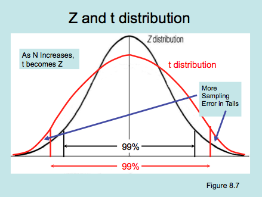

---
# Promedio de ingresos
  
- sabemos que el promedio de ingresos en la muestra CASEN 2022 es de 677.747.

- ¿con qué nivel de confianza podemos decir que este es el ingreso de la población?

- en estadística inferencial, lo que podemos ofrecer es un rango o .green[intervalo] de ingresos, con un cierto .red[nivel de confianza] y probabilidad de .red[error]


---
 # Intervalos de confianza y distribución Z
  
 .pull-left[
    Primero vamos a calcular intervalos de confianza basados en la distribución normal o basados en .red[puntajes Z]
    
    Recordemos que, $\bar{x}{\color{red}\pm}1.96SE$ abarcan el 95% de los valores alrededor del promedio
  ]

.pull-right[
  
]

---
# ¿De dónde viene ese 1.96?
  
- el valor de 1.96 viene justamente de un cálculo asociado a un $\alpha=0.05$
  
- un $\alpha=0.05$, que abarca el 95% de la distribución muestral, quiere decir que las colas de la curva quedan fuera, donde se encuentra el 5%
  
- para esto entonces necesitamos dividir este 5% en el 2,5% inferior y el 2,5% superior, y calcular el puntaje Z para cada uno

---
## Intervalos de confianza
  
.pull-left-narrow[
    ### $\bar{X}\pm Z_{\frac{\alpha}{2}}\frac{\sigma}{\sqrt{N}}$
  ]

.pull-right-wide[
  Donde
  
  - $\bar{X}$ promedio de la muestra
  - $Z$ = puntaje Z, expresado en desviaciones estándar del promedio en la curva normal
  - $\alpha$ = nivel de confianza
  - $\sigma$ = desviación estándar
  - $N$ = tamaño muestral
  - $\frac{\sigma}{\sqrt{N}}$= error estándar
]


---
  
  - calcular Z para un nivel de confianza $\alpha=0.05$ 
  - se calcula el valor para un ${\frac{\alpha}{2}}=0.025$, ya que necesitamos el puntaje Z en el nivel superior e inferior

```{r}
qnorm(0.025)
```
Y para el superior sumamos 0.025 al 0.95% de confianza:
  
  ```{r}
qnorm(0.975)
```

---
  # De vuelta a ingreso CASEN 2022
  
  .pull-left-narrow[
    ### $\bar{X}\pm Z_{\frac{\alpha}{2}}\frac{\sigma}{\sqrt{N}}$
    - $\bar{X}$ =  677.747
    - $Z$ = 1.96
    - $\alpha$ = 0.05
    - $\sigma$ = 645,027
    - $N$ = 58.240
    - $\frac{\sigma}{\sqrt{N}}$= SE (error estándar)
  ]


.pull-right-wide[
  ```{r}
  SE <- 645027/sqrt(58240)
  CI_inf <- 677747-(1.96*SE)
  CI_sup <- 677747+(1.96*SE)
  CI_inf;CI_sup
  ```
]

---
  class: inverse middle center

Por lo tanto, podemos decir con un 95% de confianza que el salario promedio se encuentra entre 672.508 y 682.985 en la población.

¿Qué hubiera pasado si hubiésemos elegido un distinto nivel de confianza?
  
  ---
  
  

---



